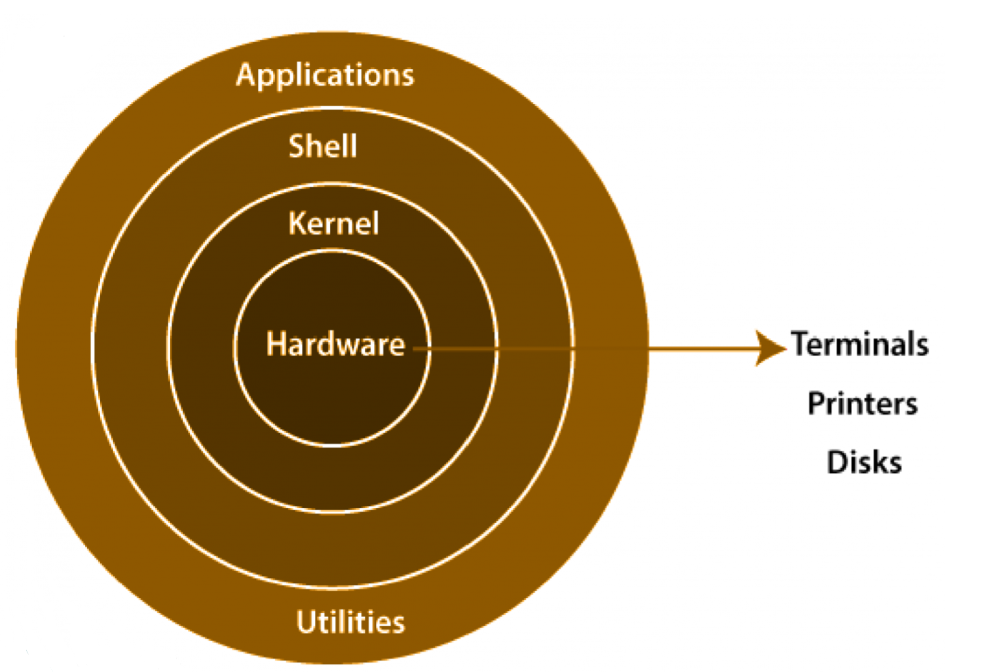

## 1.The core components of Linux (kernel, user space, init/systemd)

#### Core Components

**Kernel** — the brain of the OS. It talks directly to the hardware (CPU, RAM, disk). You never interact with it directly, it just runs everything behind the scenes.
**User Space** — where everything you actually use lives. Your browser, terminal, apps like Nginx — all running here. It talks to hardware through the kernel, never directly.
**Init System** — Its the first thing the kernel starts when your computer boots. It gets PID 1 (process ID number 1) and is responsible for starting everything else 

#### Processes

   A process is just a running program. Every time you open Chrome, run a script, or type ls — that's a process.
   Every process has a state at any given moment:
   R = Running   → actively using the CPU right now
   S = Sleeping  → waiting for something (a file, network response)
   T = Stopped   → manually paused
   Z = Zombie    → finished but its parent hasn't cleaned it up yet

#### Systemd

   The most common init system on modern Linux. Its like a service manager — it decides what starts, when, and in what order when your machine boots.
   **It handles three things:**
   **Starting services on boot** — when your machine turns on, systemd starts things like your web server, database, SSH automatically.
   **Restarting failed services** —  For example if Nginx crashes , systemd notices and restarts it without you doing anything.
   **Managing dependencies** — if service B needs service A to be running first, systemd knows that and starts them in the right order.

## 2. Most frequently commands used in my daily work

- pwd
- cd ~
- cd /
- cat
- nano
- touch
- ls -la
- history
- grep
- sudo apt-update 
- clear
- mv
- mkdir
- rm -f 
- cp
- cmp file1 file2
- echo
- tail -n file
- heal -n file
- gzip test.sql
- gunzip file.gz
- hostname
- whoami
- date
