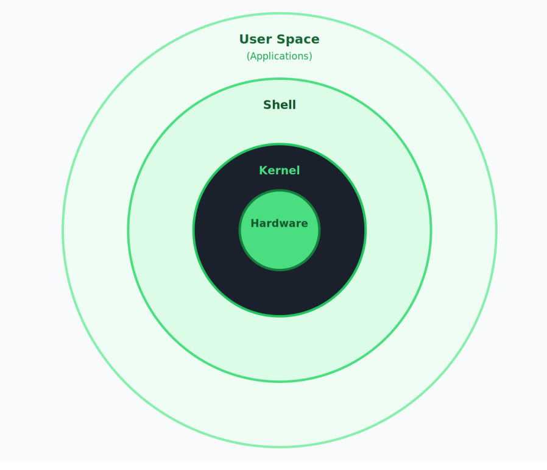

# Linux Architecture Notes

## 1. The Core Components of Linux

### Kernel
The brain of the OS. It talks directly to the hardware (CPU, RAM, disk). You never interact with it directly — it runs everything behind the scenes.

### User Space
Where everything you actually use lives — your browser, terminal, apps like Nginx. It talks to hardware through the kernel, never directly.

### Init System
The first thing the kernel starts when your computer boots. It gets **PID 1** (process ID 1) and is responsible for starting everything else.

---

## 2. Processes

A process is just a running program. Every time you open Chrome, run a script, or type `ls` — that's a process.

Every process has a **state** at any given moment:

| State | Meaning  | Description |
|-------|----------|-------------|
| `R`   | Running  | Actively using the CPU right now |
| `S`   | Sleeping | Waiting for something (a file, network response) |
| `T`   | Stopped  | Manually paused |
| `Z`   | Zombie   | Finished but its parent hasn't cleaned it up yet |

---

## 3. Systemd

The most common init system on modern Linux. It's like a service manager — it decides what starts, when, and in what order when your machine boots.

**It handles three things:**

- **Starting services on boot** — when your machine turns on, systemd starts services like your web server, database, and SSH automatically.
- **Restarting failed services** — for example, if Nginx crashes, systemd notices and restarts it without any intervention.
- **Managing dependencies** — if service B needs service A running first, systemd knows that and starts them in the right order.

---

## 4. Commands I Use Daily

### Navigation
- `pwd` — print working directory
- `cd ~` — go to home
- `cd /` — go to root
- `ls -la` — list all files with details

### File operations
- `cat` — print file contents
- `nano` — edit a file
- `touch` — create an empty file
- `mkdir` — create a directory
- `cp` — copy a file
- `mv` — move/rename a file
- `rm -f` — force remove a file
- `cmp file1 file2` — compare two files

### Viewing & searching
- `grep` — search inside files
- `tail -n file` — show last lines of a file
- `head -n file` — show first lines of a file
- `history` — show command history
- `echo` — print text

### System & utilities
- `sudo apt update` — update package lists
- `gzip test.sql` / `gunzip file.gz` — compress/decompress
- `hostname` — show machine name
- `whoami` — show current user
- `date` — show current date/time
- `clear` — clear the terminal
