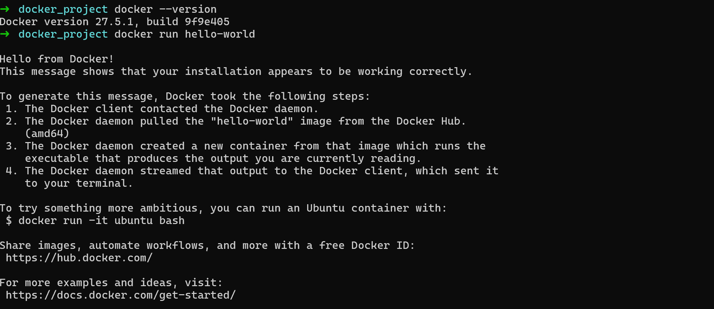
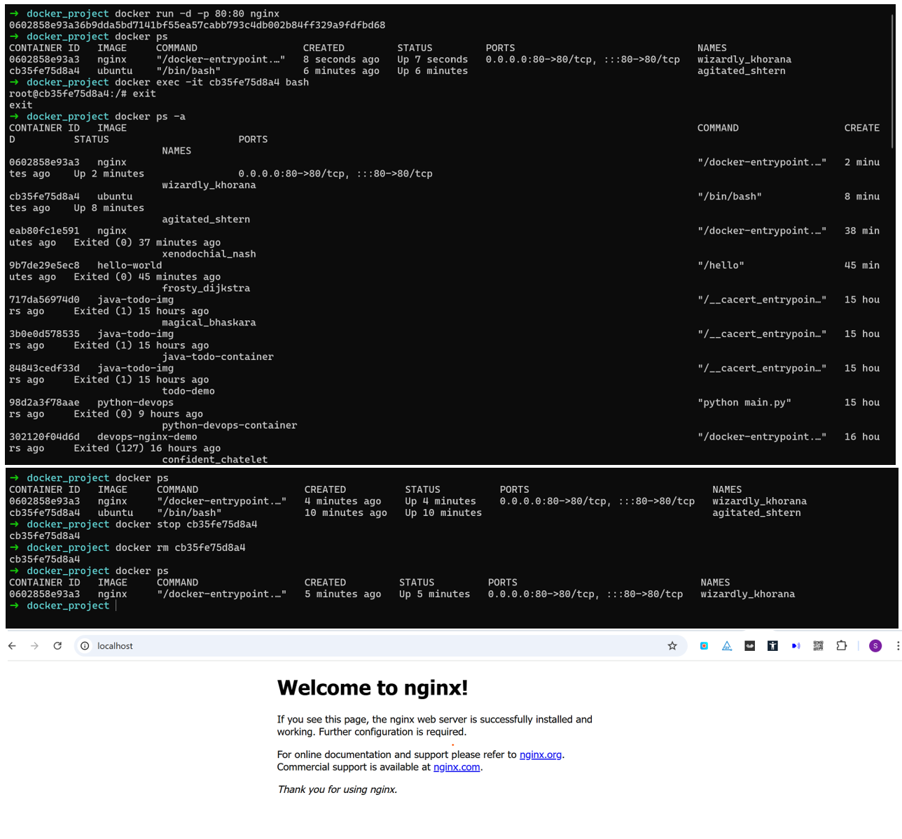
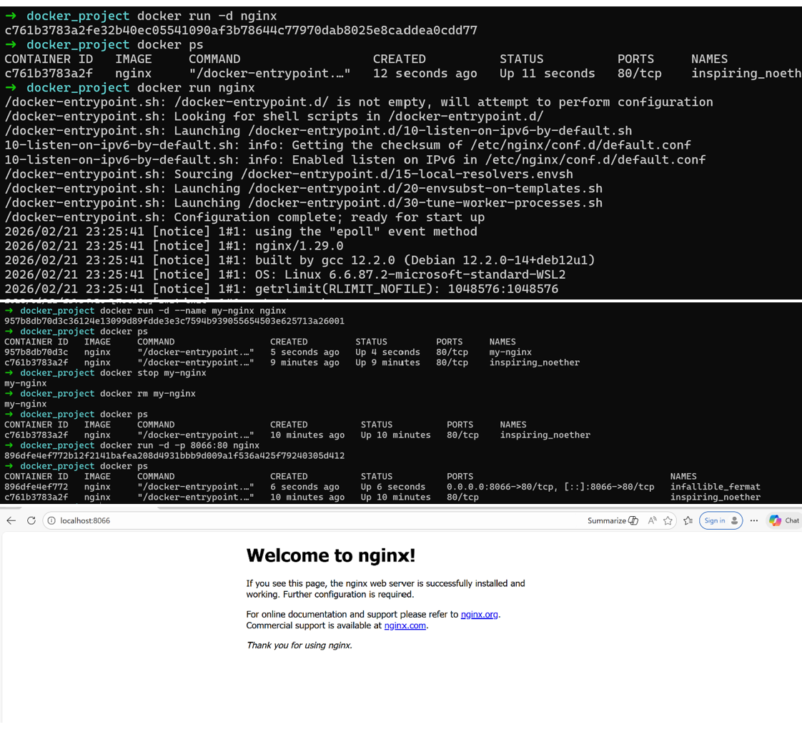
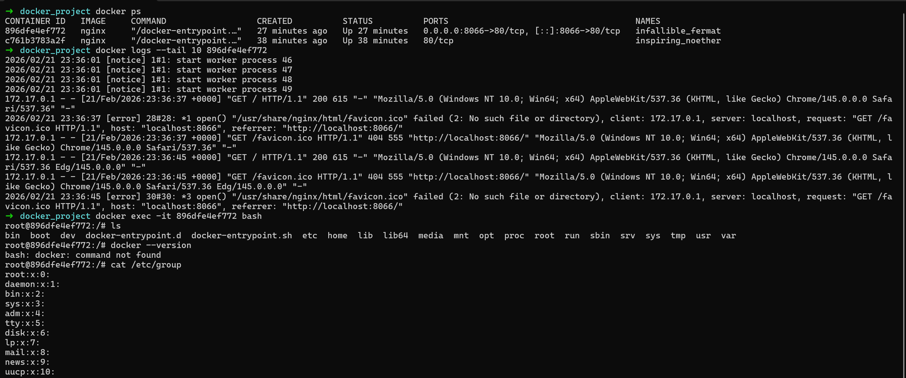

### Task 1: 

## What is Docker?
Docker wraps your application ina container that has everything your app needs to run but shares the heavy system parts with host computer it runs on.

## What is a container and why do we need them?
Container is lightweight standalone package of software that includes code, runtime, system tools and libraries.
We need them because container runs the same everywhere — your laptop, your teammate's machine, production server.

## Containers vs Virtual Machines — what's the real difference?
**Virtual Machine :** 
Pretends to be a full computer. 
It has its own OS, its own kernel. 
Heavy, slow to start, Consumes lot of RAM. 
Its like moving your completely home to a different place

**Container :**
Shares the host machine's kernel. 
Only packages the app and its dependencies. 
Lightweight, starts in seconds, uses very little RAM.
Its like moving into a furnished apartment

## What is the Docker architecture? (daemon, client, images, containers, registry)
**Docker Client** — the terminal you type commands into. Client sends  instruction to the daemon.
**Docker Daemon** — the engine running in the background on your machine. It receives instructions from the client and actually does the work — building images, starting containers, stopping them.
**Image** — a blueprint or snapshot of your app.
**Container** — a running instance of an image. You can run many containers from the same image.
**Registry** — a storage place for images. Docker Hub is the public one. GitLab or AWS have private ones. You push images there and pull them on other machines.

## Draw or describe the Docker architecture in your own words.

Client sends command → Daemon listens and executes → Container is created from the Image → Registry stores images

### Task 2: Install Docker and run hello world

### Task 3: Run Real Containers

### Task 4: Explore

