### Task 1: Docker Images
1. Pull the `nginx`, `ubuntu`, and `alpine` images from Docker Hub
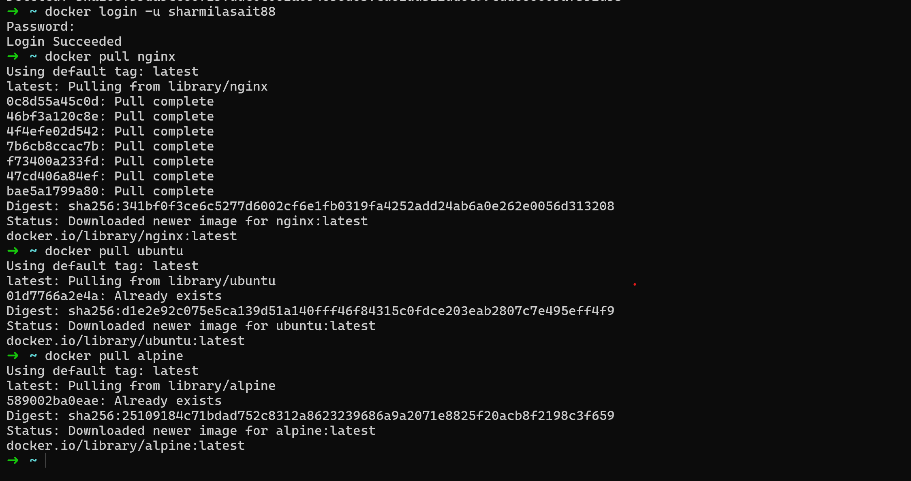

2. List all images on your machine — note the sizes
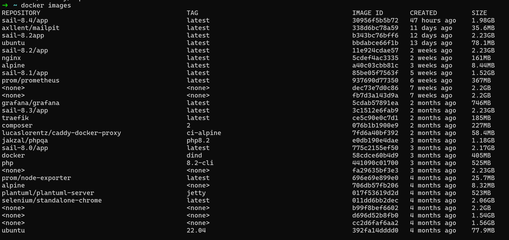

3. Compare `ubuntu` vs `alpine` — why is one much smaller?
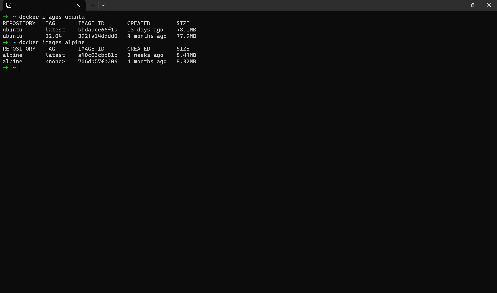

* Alpine (8MB) is much smaller than ubuntu(78MB)
* Ubuntu uses **glibc** c library which is large and feature rich. Alpine uses **musl libc** which is much smaller and simpler.
* Ubuntu comes with hundreds of packages pre-installed for desktop and server use. Alpine ships with almost nothing — just a shell and a package manager.

4. Inspect an image — what information can you see?
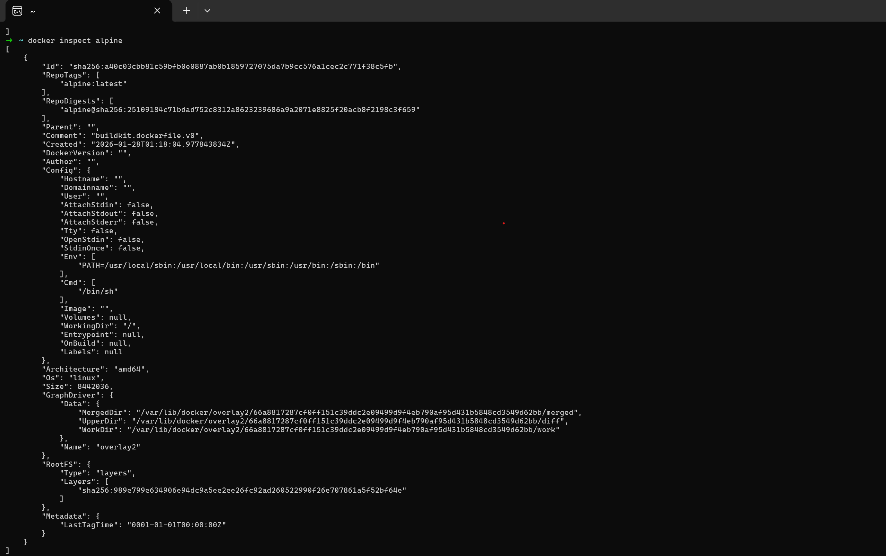
Ex: alpine
We can retrieve information related to ID, created date, size, architecture, OS, Author etc.

5. Remove an image you no longer need
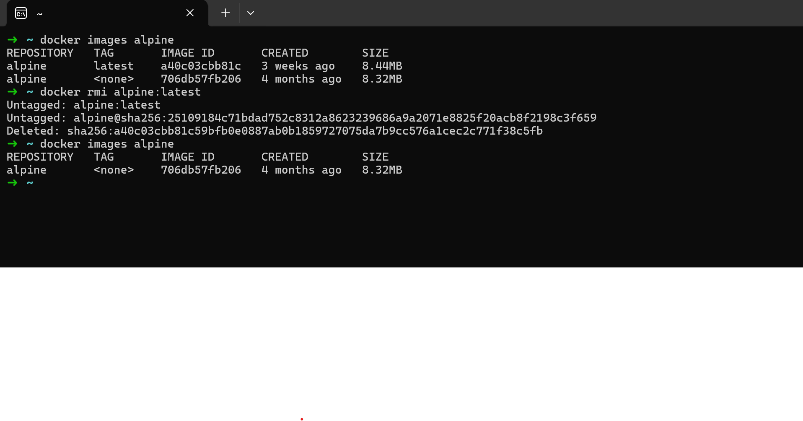

### Task 2: Image Layers
1. Run `docker image history nginx` — what do you see?
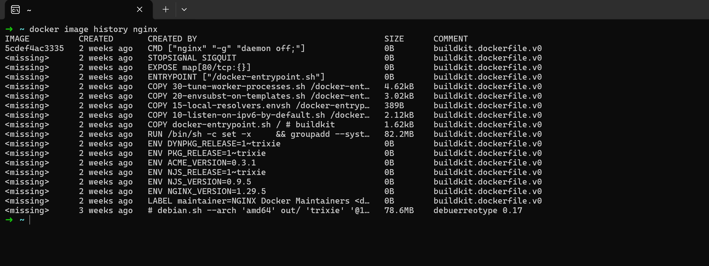

2. Each line is a **layer**. Note how some layers show sizes and some show 0B
   Definition:
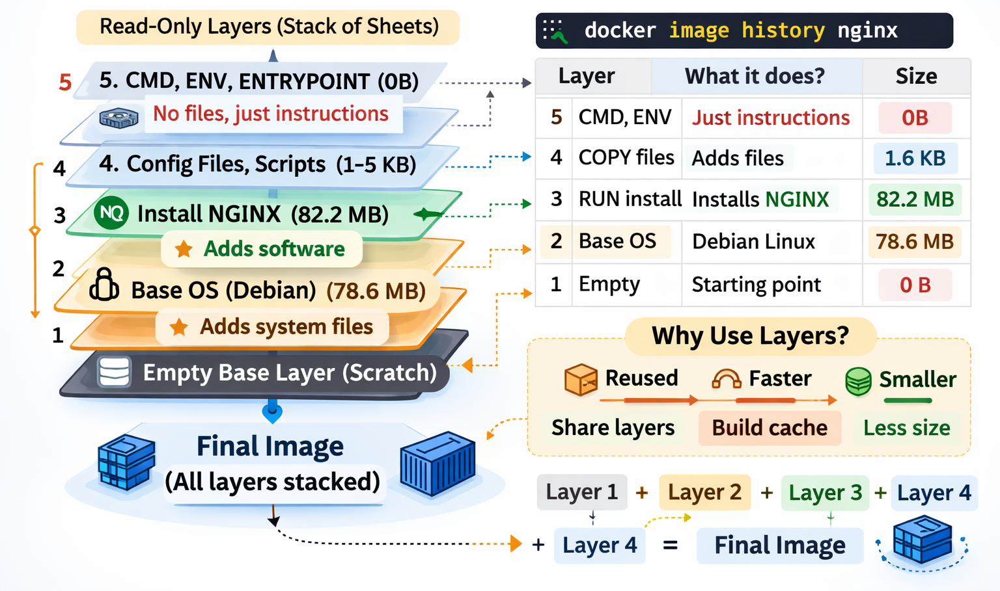
* A layer is a read-only filesystem change.
* It represents a single instruction in a Dockerfile (RUN, COPY, ENV, etc.).
* The final image is a stack of layers.
* Some layers add size (files, packages), others are metadata only (CMD, ENV, ENTRYPOINT) and show 0B.”
* **Example from your nginx image:**
  Base OS: Debian layer → 78.6MB
  NGINX packages installed: → 82.2MB
  Scripts & environment vars → small sizes (0–few KB)
  CMD/ENTRYPOINT/ENV → 0B (no new files, just metadata)

3. Why does Docker use layers?
**Reusability:**
If multiple images use the same base layer, Docker downloads it once and shares it.
**Caching:**
Layers are cached. If you rebuild an image and no change in layer, Docker reuses it instead of rebuilding.
**Smaller downloads & storage:**
Only new or changed layers are downloaded or saved.

### Task 3: Container Lifecycle
Practice the full lifecycle on one container:
1. **Create** a container (without starting it)
2. **Start** the container
3. **Pause** it and check status
4. **Unpause** it
5. **Stop** it
6. **Restart** it
7. **Kill** it
8. **Remove** it
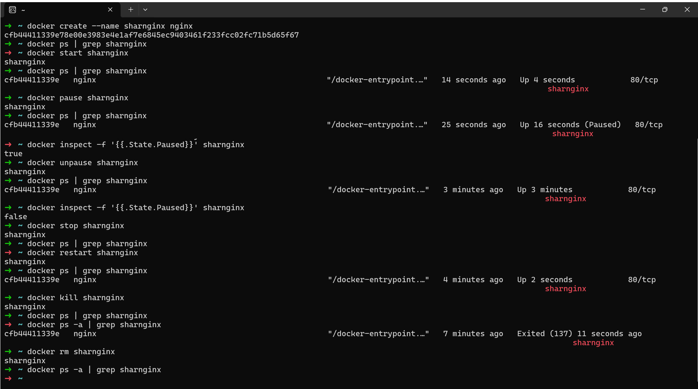

### Task 4: Working with Running Containers
1. Run an Nginx container in detached mode
2. View its **logs**
3. View **real-time logs** (follow mode)
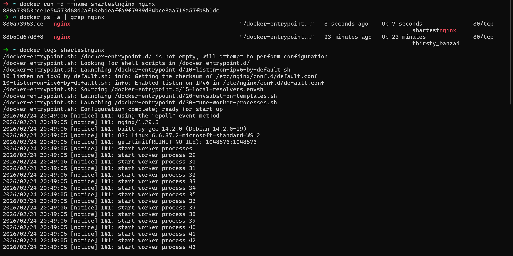

4. **Exec** into the container and look around the filesystem
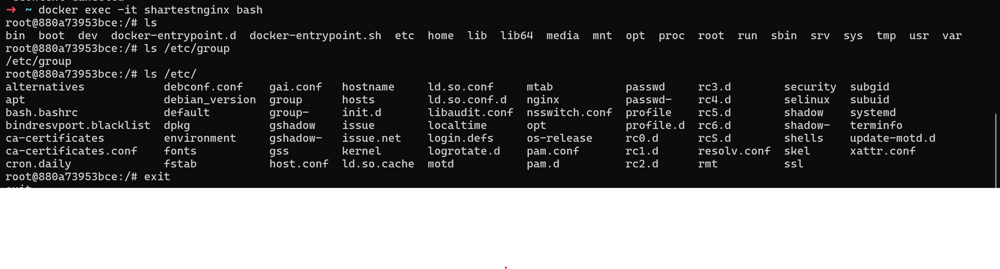

5. Run a single command inside the container without entering it
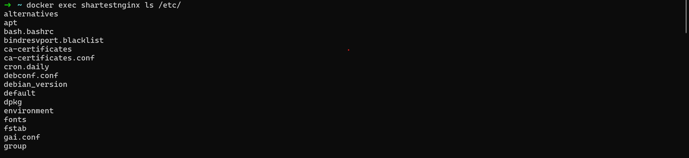

6. **Inspect** the container — find its IP address, port mappings, and mounts
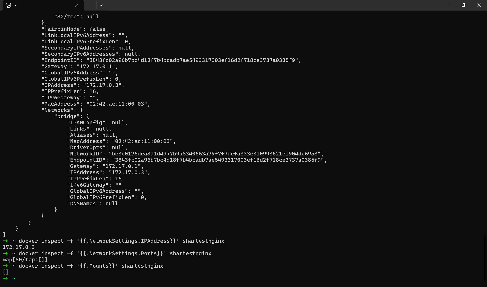