## Challenge Tasks

### Task 1: Your First Dockerfile

1. Create a folder called `my-first-image`
   **mkdir my-first-image**

2. Inside it, create a `Dockerfile` that:
    - Uses `ubuntu` as the base image
    - Installs `curl`
    - Sets a default command to print `"Hello from my custom image!"`
      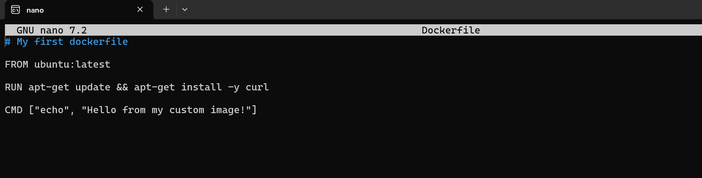

3. Build the image and tag it `my-ubuntu:v1`
   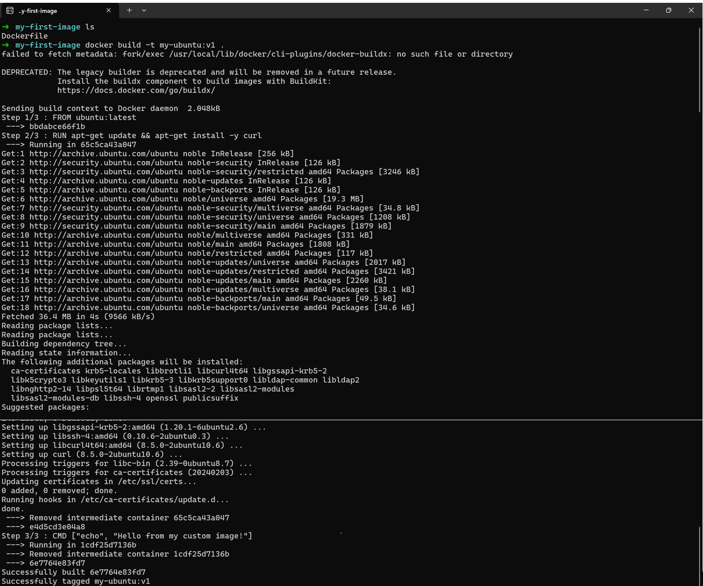

4. Run a container from your image
   **Verify:** The message prints on `docker run`
   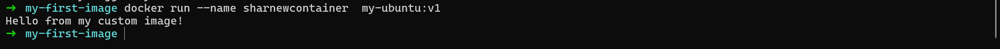

### Task 2: Dockerfile Instructions
Create a new Dockerfile that uses **all** of these instructions:
- `FROM` — base image
- `RUN` — execute commands during build
- `COPY` — copy files from host to image
- `WORKDIR` — set working directory
- `EXPOSE` — document the port
- `CMD` — default command
Build and run it. Understand what each line does.

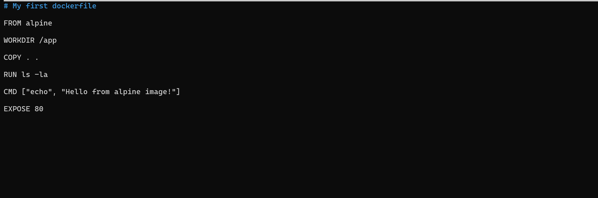
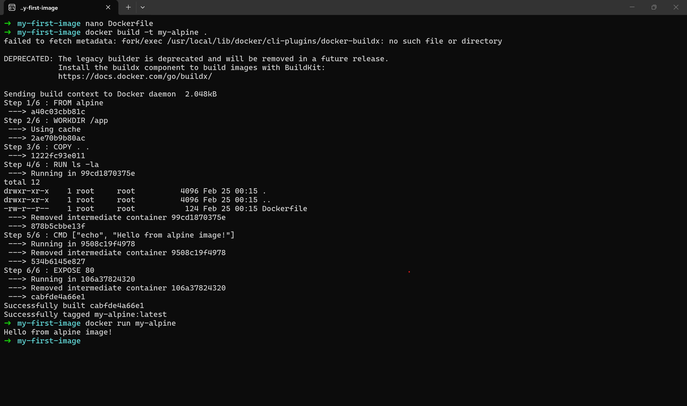

### Task 3: CMD vs ENTRYPOINT
1. Create an image with `CMD ["echo", "hello"]` — run it, then run it with a custom command. What happens?
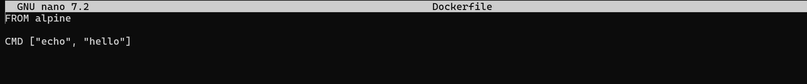
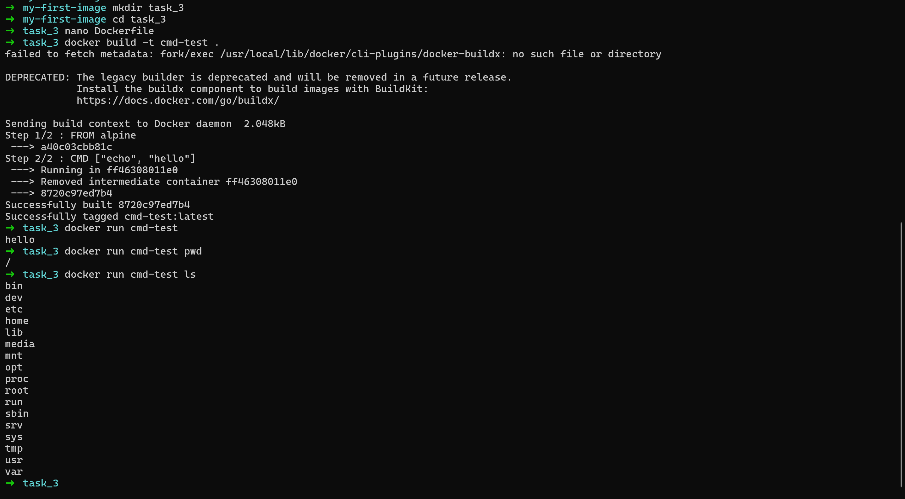

2. Create an image with `ENTRYPOINT ["echo"]` — run it, then run it with additional arguments. What happens?
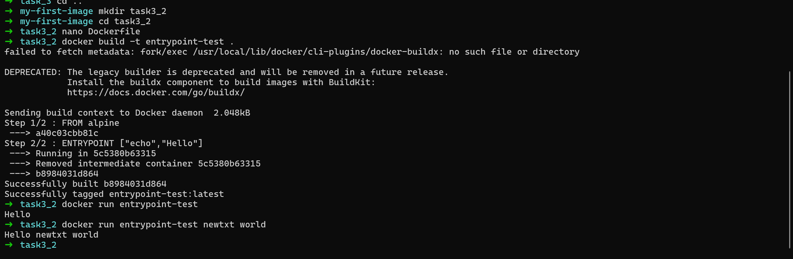
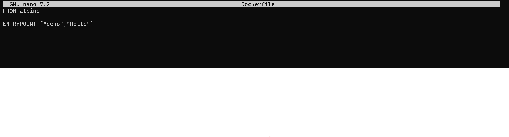

3. Write in your notes: When would you use CMD vs ENTRYPOINT?
ENTRYPOINT defines the main executable that always runs and is fixed, while CMD provides default arguments that can be overridden at runtime.

---

### Task 4: Build a Simple Web App Image
1. Create a small static HTML file (`index.html`) with any content
2. Write a Dockerfile that:
    - Uses `nginx:alpine` as base
    - Copies your `index.html` to the Nginx web directory
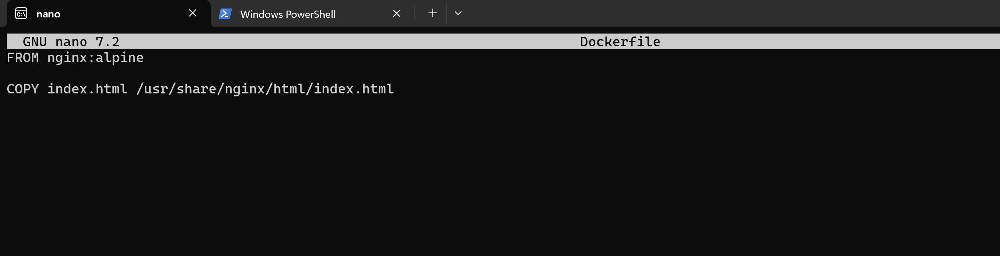

3. Build and tag it `my-website:v1`
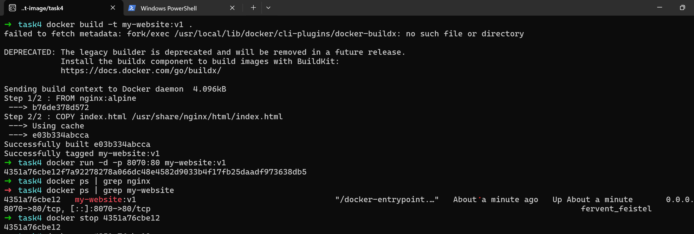

4. Run it with port mapping and access it in your browser
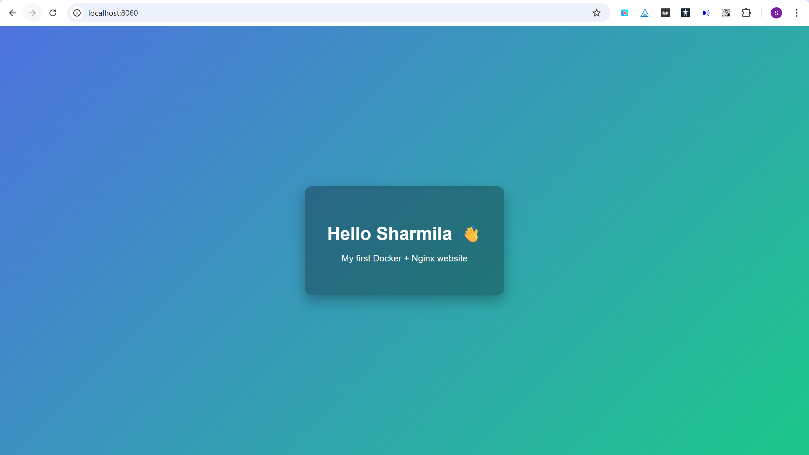

### Task 5: .dockerignore
1. Create a `.dockerignore` file in one of your project folders
2. Add entries for: `node_modules`, `.git`, `*.md`, `.env`
3. Build the image — verify that ignored files are not included

### Task 6: Build Optimization
1. Build an image, then change one line and rebuild — notice how Docker uses **cache**
2. Reorder your Dockerfile so that frequently changing lines come **last**

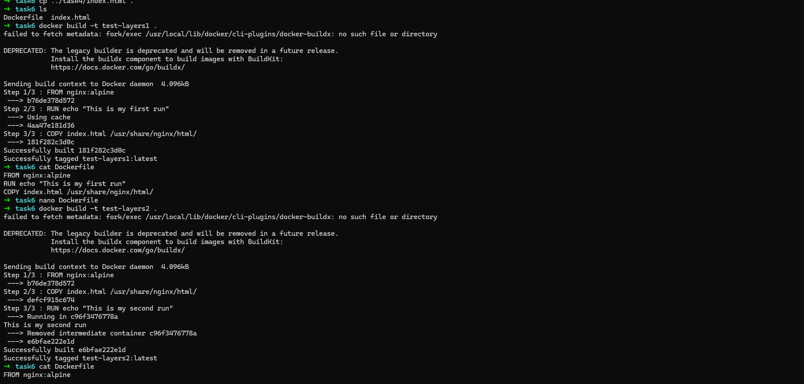

3. Write in your notes: Why does layer order matter for build speed?
Docker builds each line as a layer and caches it. When a layer changes, all layers below it are re-run. 
So if you put your code copy at the top, every step below it — even slow ones like npm install — re-runs every time you change a single file. 
Put slow, stable steps first and frequently changing files last so Docker can skip the slow steps from cache.

## Hints
- Build: `docker build -t name:tag .`
- The `.` at the end is the build context
- `COPY . .` copies everything from host to container
- Nginx serves files from `/usr/share/nginx/html/`

---

## Submission
1. Add your Dockerfiles and `day-31-dockerfile.md` to `2026/day-31/`
2. Commit and push to your fork

---

## Learn in Public
Share your custom Docker image or Nginx screenshot on LinkedIn.

`#90DaysOfDevOps` `#DevOpsKaJosh` `#TrainWithShubham`

Happy Learning!
**TrainWithShubham**
