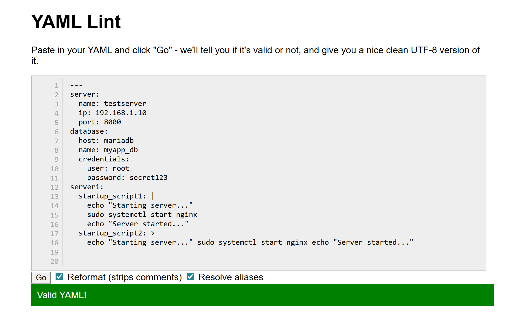
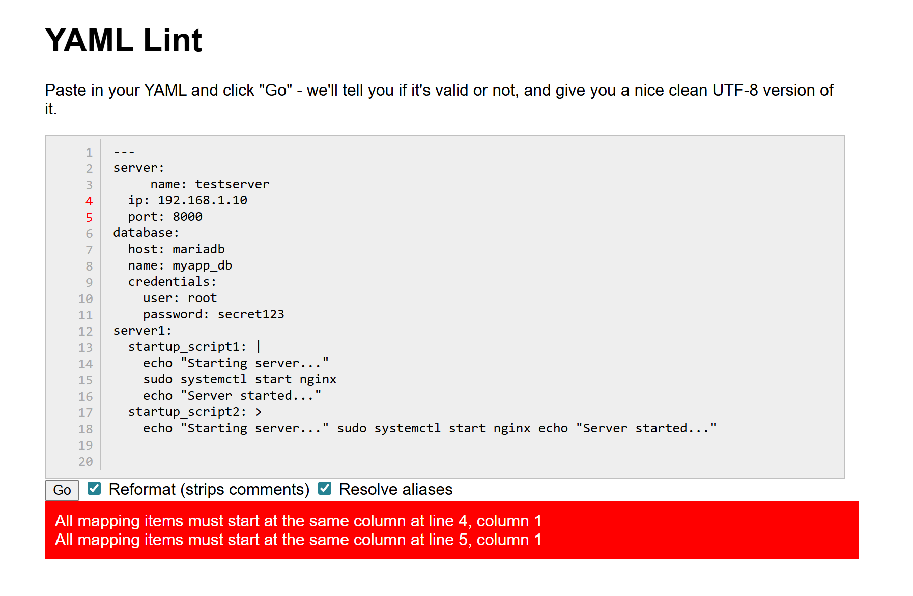

##### 1. Two ways to write a list in YAML?
We can write the lists in yaml in block style and inline style

**Block style:**
hobbies:
    - reading
    - traveling

**Inline Style:**
hobbies: [reading, traveling]

##### 4. When would you use `|` vs `>`?
Use | --> When line breaks must be preserved
Use > --> When you want multiple lines to be treated as one long line in yaml

##### 5. Validate Your YAML
Install `yamllint` or use an online validator

##### Task 6: Spot the Difference
Read both blocks and write what's wrong with the second one:

# Block 1 - correct
name: devops
tools:
  - docker
  - kubernetes

# Block 2 - broken
name: devops
tools:
- docker
  - kubernetes
  
Indentation is the issue with block2.

