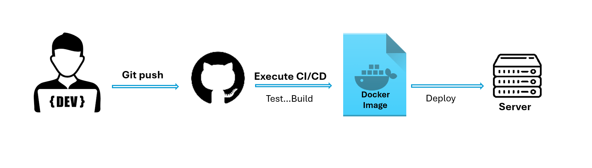
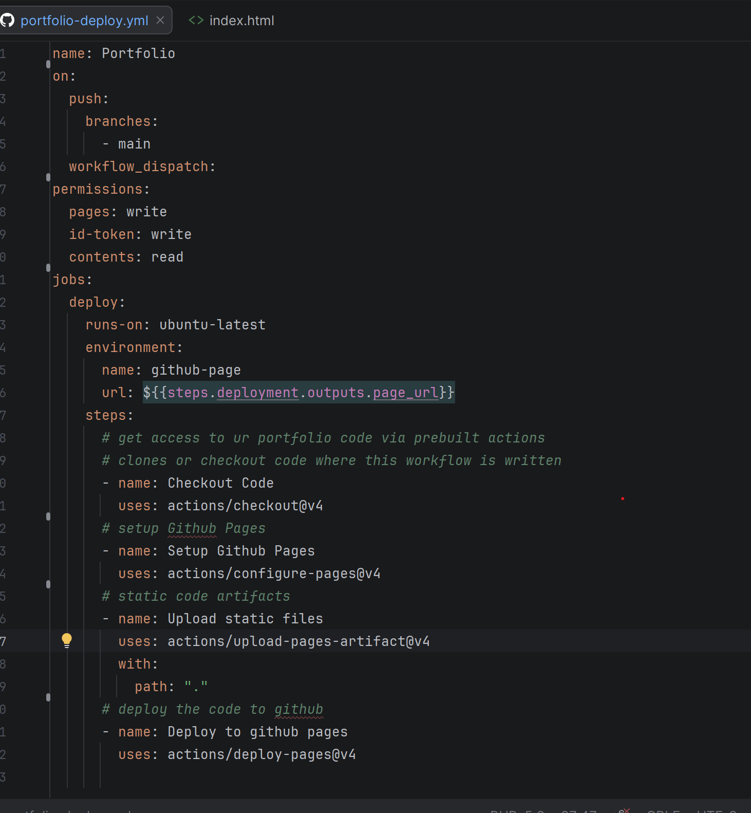

### What is CI/CD?
**CI/CD** means automating how code is checked, built, and released.
Continuous Integration focuses on building, testing, and catching issues early
Continuous Delivery / Deployment focuses on getting the checked code released

### Task 1: Think about a team of 5 developers all pushing code to the same repo manually deploying to production.
##### 1. What can go wrong?
* When developers push code to same repo there cane be:
* code conflicts in same files 
* missed files or overwriting
* wrong version deployment
* human mistakes bugs reaching production

##### 2. What does "it works on my machine" mean and why is it a real problem?
It means the code runs on one developer’s computer but fails elsewhere because the environment, config, dependencies, or data are different. 
It is a real problem because production and all teammates may not have same setup as the working machine.

##### 3. How many times a day can a team safely deploy manually? 
Usually 1-2 times a day safely, sometimes just once, because manual deployment is slow and error-prone.

### Task 2: CI vs CD
1. **Continuous Integration** — what happens, how often, what it catches
   **CI = Continuous Integration**
   Developers keep merging code often, and the system automatically checks it, like linting, testing, and building.
  or automatically deployed.

2. **Continuous Delivery** — how it's different from CI, what "delivery" means
   After code checks pass, the code is _prepared_ for release and this is done by manual trigger.

3. **Continuous Deployment** — how it differs from Delivery, when teams use it
   After code checks pass, the code is _prepared_ for release and deployed automatically
   Teams use it when they have strong automated testing and want very fast, frequent releases.

### Task 3: Pipeline Anatomy
- **Trigger** — the event that starts the pipeline, like a push, merge request, or manual run.
- **Stage** — a main phase in the pipeline, such as build, test, or deploy.
- **Job** — a unit of work or specific task inside a stage like running PHPStan or building a Docker image.
- **Step** — a single command or action inside a job like composer install or npm run build.
- **Runner** — the machine o agent that executes the job
- **Artifact** — output produced by a job

### Task 4: Draw a Pipeline
Draw a CI/CD pipeline for this scenario:
A developer pushes code to GitHub. The app is tested, built into a Docker image, and deployed to a staging server.

### Task 5: Explore in the Wild

- What triggers it?
  It runs when code is pushed to the main branch (in the above example), or when started manually using workflow_dispatch.

- How many jobs does it have?
  It has 1 'deploy' job.

- What does it do? (best guess)
  On git push github actions sets up GitHub Pages, uploads the static site files as an artifact, and deploys the portfolio to GitHub Pages.