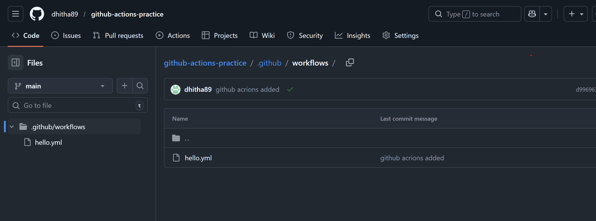
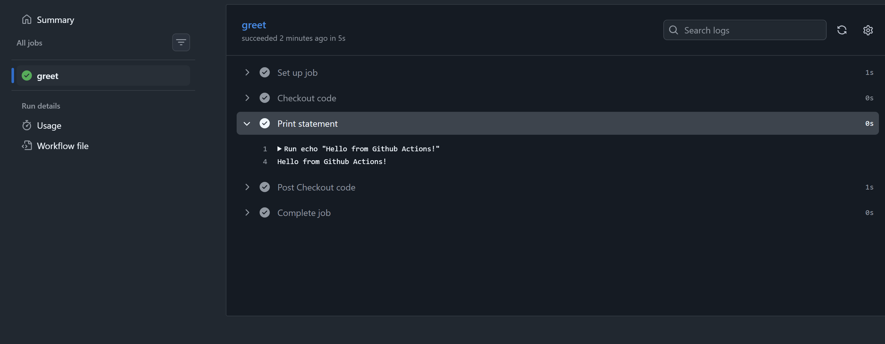
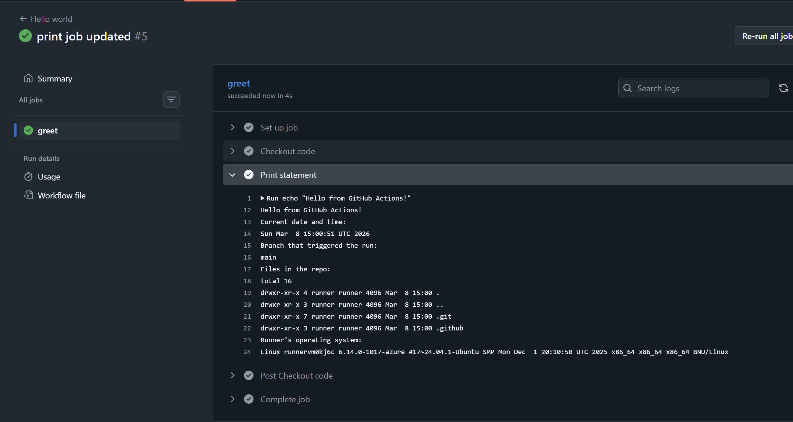
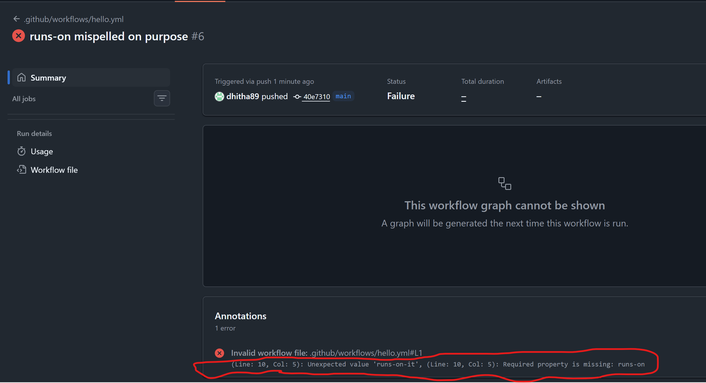
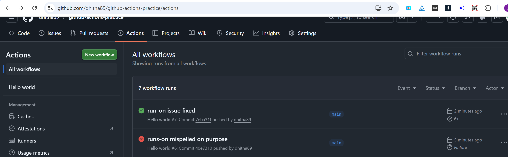

### Task 1: Set Up
1. Create a new **public** GitHub repository called `github-actions-practice`
2. Clone it locally
3. Create the folder structure: `.github/workflows/`




### Task 2: Hello Workflow
Create `.github/workflows/hello.yml` with a workflow that:
1. Triggers on every `push`
2. Has one job called `greet`
3. Runs on `ubuntu-latest`
4. Has two steps:
    - Step 1: Check out the code using `actions/checkout`
    - Step 2: Print `Hello from GitHub Actions!`
   



### Task 3: Understand the Anatomy
Look at your workflow file and write in your notes what each key does:

Workflow File: `hello.yml`

```
name: Hello world

on:
  push:
    branches:
      - main

jobs:
  greet:
    runs-on: ubuntu-latest
    steps:
      - name: Checkout code
        uses: actions/checkout@v4

      - name: Print statement
        run: echo "Hello from Github Actions!"
```

**`on:`**
Defines the events that triggers the workflow to run. In this workflow, it's triggered by `push` events on the `main` branch. 
Other possible triggers include: `pull_request`, `schedule`, `workflow_dispatch`, `issues`, `release`, etc.

**`jobs:`**
Defines specific task inside stage. Each job runs in its own isolated environment and can run sequentially or in parallel. In this workflow, there is one job named `greet`.

**`runs-on:`**
Specifies the runner (virtual machine or container) where the job executes. This workflow uses `ubuntu-latest`, which is a GitHub-hosted runner.

**`steps:`**
They are list of tasks that execute sequentially within a job. Each step can either run a shell command using `run:` or use a pre-built action using `uses:`. In this workflow, there are two steps.

**`uses:`**
Runs a pre-built GitHub Action (published by GitHub or the community). This workflow uses `actions/checkout@v4`, which clones the repository code so subsequent steps can access it. The `@v4` specifies the version to use.

**`run:`**
Executes a shell command directly in the runner's command line (bash on Linux/macOS, PowerShell on Windows by default). In this workflow, the second step runs `echo "Hello from Github Actions!"` to print a message.

**`name:` (on a step)**
Provides a human-readable label for a step that appears in the GitHub Actions. In this workflow, the steps are named "Checkout code" and "Print statement" to make the workflow easy to understand and debug.

### Task 4: Add More Steps
Update `hello.yml` to also:
1. Print the current date and time
2. Print the name of the branch that triggered the run (hint: GitHub provides this as a variable)
3. List the files in the repo
4. Print the runner's operating system




### Task 5: Break It On Purpose
1. Add a step that runs a command that will **fail** (e.g., `exit 1` or a misspelled command)
2. Push and observe what happens in the Actions tab
3. Fix it and push again

```
name: Hello world

on:
  push:
    branches:
      - main

jobs:
  greet:
    runs-on-it: ubuntu-latest # introduce the error here
    steps:
      - name: Checkout code
        uses: actions/checkout@v4
        
 ```
The pipeline fails on push and shows error



The runs-on issue fixed and teh pipeline is green again

