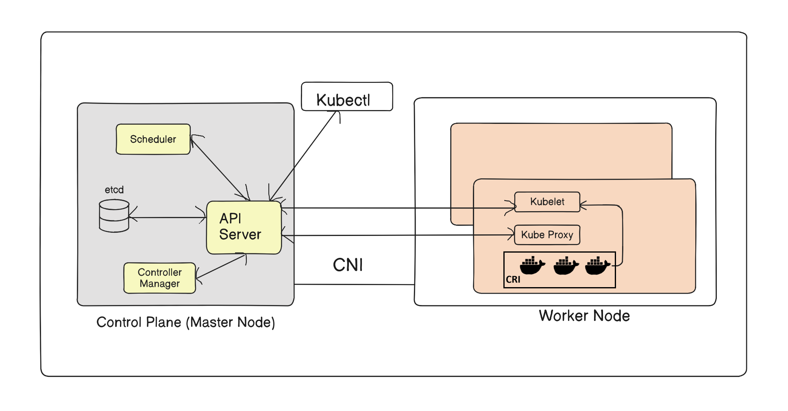
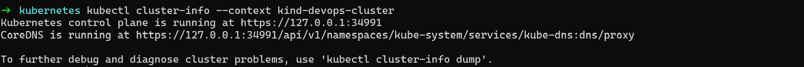
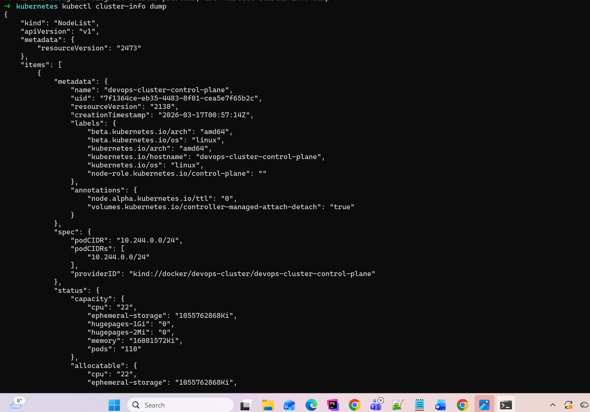
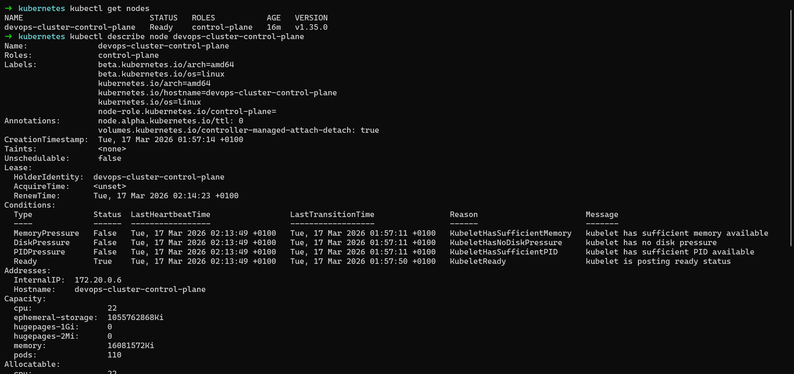
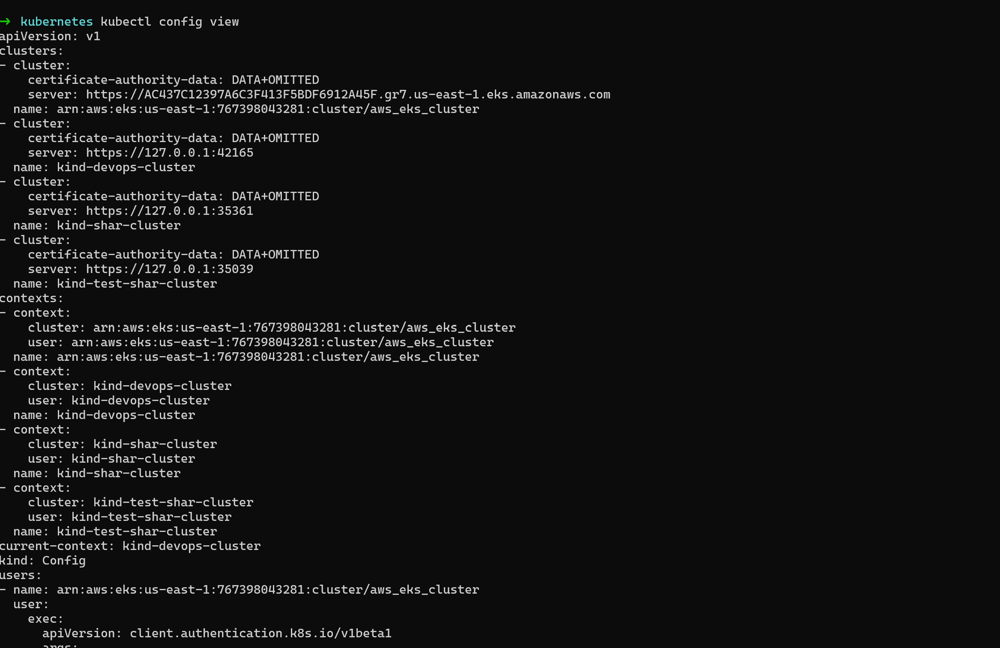

### Task 1: 
**1. Why was Kubernetes created? What problem does it solve that Docker alone cannot?**
In 2014 Google had issues maintaining and autoscaling their applications . They also had to fix things manually incase of crash. 
Hence they developed an internal system called BORG.
Borg autoscales and autoheals the applications running on their server. It can balance the traffic hitting the server. 
Docker can run only individual containers, but Kubernetes can orchestrate containerized docker applications at cluster scale.

**2. Who created Kubernetes and what was it inspired by?**
Google created Borg, later it was made open-source and donated to CNCF where they named it Kubernetes.

**3. What does the name "Kubernetes" mean?**
Kubernetes is Greek word meaning helmsmen of a ship.


### Task 2: Draw the Kubernetes Architecture
**Control Plane (Master Node):**
- API Server — the front door to the cluster, every command goes through it
- etcd — the database that stores all cluster state
- Scheduler — decides which node a new pod should run on
- Controller Manager — watches the cluster and makes sure the desired state matches reality

**Worker Node:**
- kubelet — the agent on each node that talks to the API server and manages pods
- kube-proxy — handles networking rules so pods can communicate
- Container Runtime — the engine that actually runs containers (containerd, CRI-O)


**- What happens when you run `kubectl apply -f pod.yaml`? Trace the request through each component.**
The instructions are handed over to cluster regarding requirement for new pod. Kubectl sends yaml to the API Server, which saves it to etcd (the database). The Scheduler looks at it and says "ok, worker node 2 has space, put it there." 
Then kubelet on that worker node sees the assignment, pulls the container image, and starts it. Done.

**- What happens if the API server goes down?**
Everything that's already running keeps running — containers don't stop. You can't run any kubectl commands, nothing new can be scheduled, and if a pod crashes nobody can restart it. 
The cluster is frozen in place until the API Server comes back.

**- What happens if a worker node goes down?**
If the worker node goes down, the Controller Manager detects the failure. The Scheduler immediately assigns lost container to healthy nodes
in the cluster to maintain application availability.

### Task 3: Install kubectl
`kubectl` is the CLI tool you will use to talk to your Kubernetes cluster.
➜  ~ kubectl version
Client Version: v1.35.2
Kustomize Version: v5.7.1
Server Version: v1.35.1


### Task 4: Set Up Your Local Cluster
# Create a cluster
**kind create cluster --name devops-cluster**
Creating cluster "devops-cluster" ...
✓ Ensuring node image (kindest/node:v1.35.0) 🖼
✓ Preparing nodes 📦
✓ Writing configuration 📜
✓ Starting control-plane 🕹️
✓ Installing CNI 🔌
✓ Installing StorageClass 💾
Set kubectl context to "kind-devops-cluster"
You can now use your cluster with:

kubectl cluster-info --context kind-devops-cluster

Have a nice day! 👋

# Verify
**kubectl cluster-info --context kind-devops-cluster**
Kubernetes control plane is running at https://127.0.0.1:34991
CoreDNS is running at https://127.0.0.1:34991/api/v1/namespaces/kube-system/services/kube-dns:dns/proxy

**kubectl get nodes**
NAME                           STATUS   ROLES           AGE     VERSION
devops-cluster-control-plane   Ready    control-plane   6m51s   v1.35.0

**Write down: Which one did you choose and why?**
I choose Kind instead of Minikube.
Kind runs each node as container and entire cluster is just containers as compared to Minikube which spins up VM machine.


### Task 5: Explore Your Cluster

# See cluster info
**kubectl cluster-info --context kind-devops-cluster**


**kubectl cluster-info dump**


# List all nodes
**kubectl get nodes**
NAME                           STATUS   ROLES           AGE   VERSION
devops-cluster-control-plane   Ready    control-plane   16m   v1.35.0

# Get detailed info about your node
**kubectl describe node**


# List all namespaces
**kubectl get namespaces**
NAME                 STATUS   AGE
default              Active   28m
kube-node-lease      Active   28m
kube-public          Active   28m
kube-system          Active   28m
local-path-storage   Active   28m

# See ALL pods running in the cluster (across all namespaces)
**kubectl get pods -A**
NAMESPACE            NAME                                                   READY   STATUS    RESTARTS   AGE
kube-system          coredns-7d764666f9-75sbh                               1/1     Running   0          29m
kube-system          coredns-7d764666f9-fx2cx                               1/1     Running   0          29m
kube-system          etcd-devops-cluster-control-plane                      1/1     Running   0          29m
kube-system          kindnet-2nkkf                                          1/1     Running   0          29m
kube-system          kube-apiserver-devops-cluster-control-plane            1/1     Running   0          29m
kube-system          kube-controller-manager-devops-cluster-control-plane   1/1     Running   0          29m
kube-system          kube-proxy-tpzx9                                       1/1     Running   0          29m
kube-system          kube-scheduler-devops-cluster-control-plane            1/1     Running   0          29m
local-path-storage   local-path-provisioner-67b8995b4b-ccxp2                1/1     Running   0          29m

**kubectl get pods -n kube-system**
NAME                                                   READY   STATUS    RESTARTS   AGE
coredns-7d764666f9-75sbh                               1/1     Running   0          30m
coredns-7d764666f9-fx2cx                               1/1     Running   0          30m
etcd-devops-cluster-control-plane                      1/1     Running   0          30m
kindnet-2nkkf                                          1/1     Running   0          30m
kube-apiserver-devops-cluster-control-plane            1/1     Running   0          30m
kube-controller-manager-devops-cluster-control-plane   1/1     Running   0          30m
kube-proxy-tpzx9                                       1/1     Running   0          30m
kube-scheduler-devops-cluster-control-plane            1/1     Running   0          30m


### Task 6: Practice Cluster Lifecycle

# Delete your cluster
**kind delete cluster --name devops-cluster**
Deleting cluster "devops-cluster" ...
Deleted nodes: ["devops-cluster-control-plane"]

Try these useful commands:```bash
# Check which cluster kubectl is connected to
**kubectl config current-context**
kind-devops-cluster

# List all available contexts (clusters)
** kubectl config get-contexts**
CURRENT   NAME                                                         CLUSTER                                                      AUTHINFO                                                     NAMESPACE
arn:aws:eks:us-east-1:767398043281:cluster/aws_eks_cluster   arn:aws:eks:us-east-1:767398043281:cluster/aws_eks_cluster   arn:aws:eks:us-east-1:767398043281:cluster/aws_eks_cluster
*         kind-devops-cluster                                          kind-devops-cluster                                          kind-devops-cluster              
          kind-shar-cluster                                            kind-shar-cluster                                            kind-shar-cluster                
          kind-test-shar-cluster                                       kind-test-shar-cluster                                       kind-test-shar-cluster           

# See the full kubeconfig
**kubectl config view**
