### Task 1: Create Your First Pod (Nginx)
Create a file called `nginx-pod.yaml`:
# Apply it:
kubectl apply -f nginx-pod.yaml
# Verify:
kubectl get pods
kubectl get pods -o wide
# Detailed info about the pod
kubectl describe pod nginx-pod
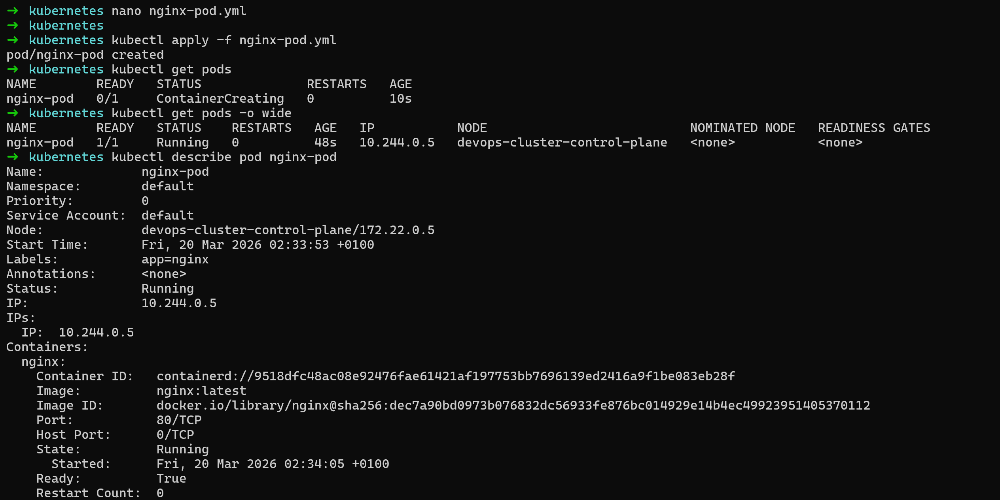

# Read the logs
kubectl logs nginx-pod
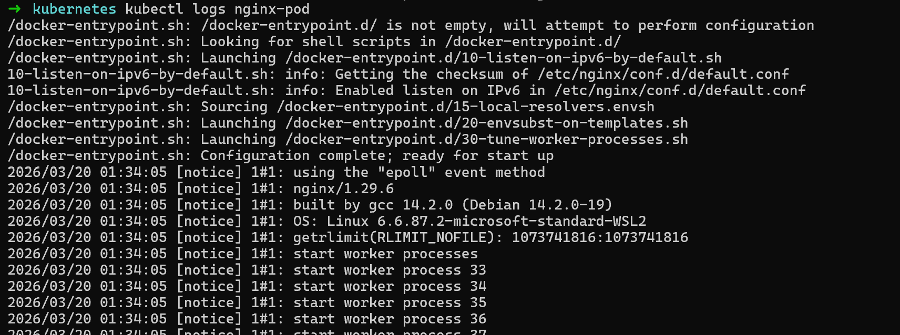

# Get a shell inside the container
kubectl exec -it nginx-pod -- /bin/bash
# Inside the container, run:
curl localhost:80
exit
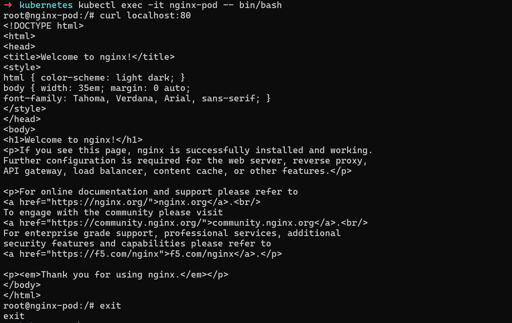

### Task 2: Create a Custom Pod (BusyBox)
# Write a new manifest `busybox-pod.yaml`
# Apply and verify:
kubectl apply -f busybox-pod.yaml
kubectl get pods
kubectl logs busybox-pod
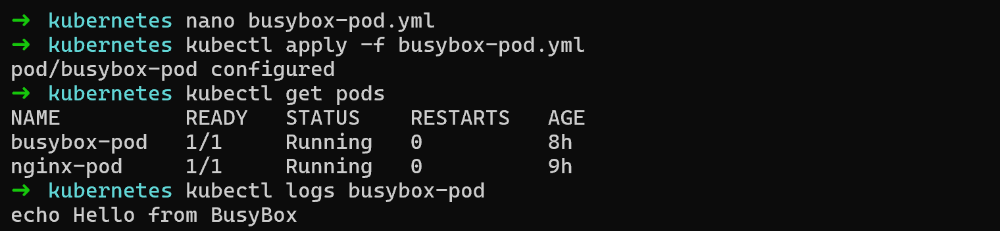

### Task 3: Imperative vs Declarative
**You have been using the declarative approach (writing YAML, then `kubectl apply`). Kubernetes also supports imperative commands:**
# Create a pod without a YAML file
kubectl run redis-pod --image=redis:latest
Now extract the YAML that Kubernetes generated:
kubectl get pod redis-pod -o yaml
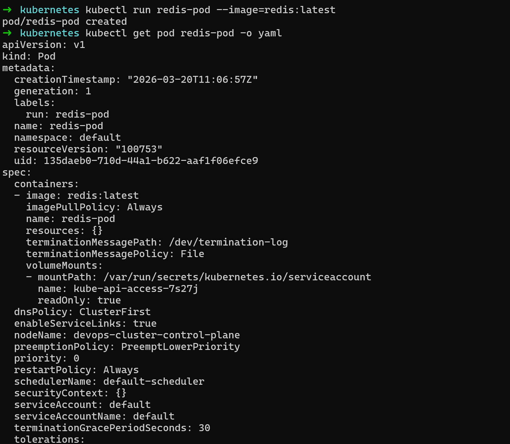

# Check it
kubectl get pods
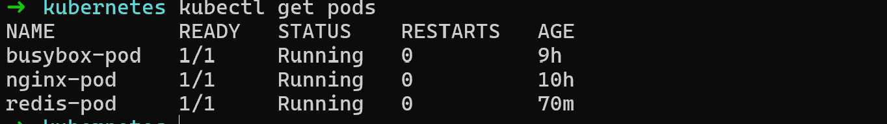

**You can also use dry-run to generate YAML without creating anything:**
kubectl run test-pod --image=nginx --dry-run=client -o yaml
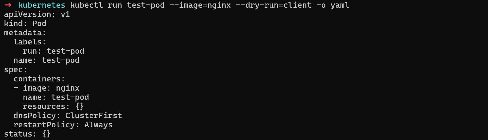

save the output in file and compare its structure with your nginx-pod.yaml. What fields are the same? What is different?
kubectl run test-pod --image=nginx --dry-run=client -o yaml > test-pod.yml

diff -u nginx-pod.yml test-pod.yml
# Similarity:
apiVersion: v1        
kind: Pod             
metadata:             
spec:                 
containers:         
- image: nginx      

# Difference:
nginx-pod.yml has:
- labels
- ports->containerPort
test-pod has:
-  resources: {}
   dnsPolicy: ClusterFirst
   restartPolicy: Always
   status: {}

### Task 4: Validate Before Applying
Before applying a manifest, you can validate it:

# Check if the YAML is valid without actually creating the resource
kubectl apply -f nginx-pod.yaml --dry-run=client
**When to use : Just checking your YAML syntax quickly**

# Validate against the cluster's API (server-side validation)
kubectl apply -f nginx-pod.yaml --dry-run=server
**When to use: Before applying to production — full check**

| | `--dry-run=client` | `--dry-run=server` |
|---|---|---|
| **Where it runs** | Your local machine | Actual Kubernetes API |
| **Needs cluster connection** | ❌ No | ✅ Yes |
| **What it checks** | YAML structure + basic fields | Everything client does + cluster rules |
| **Catches missing image** | ✅ Yes | ✅ Yes |
| **Catches invalid image name** | ❌ No | ✅ Yes |
| **Catches duplicate resource** | ❌ No | ✅ Yes |
| **Checks admission controllers** | ❌ No | ✅ Yes |
| **Best for** | Quick syntax check | Full pre-flight check |

Eg: nginx-pod.yml (make some indentation error)
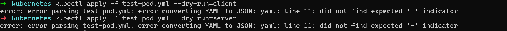

Eg: remove image name in the yml
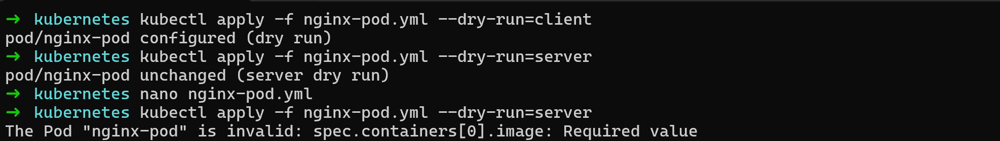

### Task 5: Pod Labels and Filtering
# List all pods with their labels
kubectl get pods --show-labels
# Filter pods by label
kubectl get pods -l app=nginx
kubectl get pods -l environment=dev
# Add a label to an existing pod
kubectl label pod nginx-pod environment=production
# Verify
kubectl get pods --show-labels
# Remove a label
kubectl label pod nginx-pod environment-

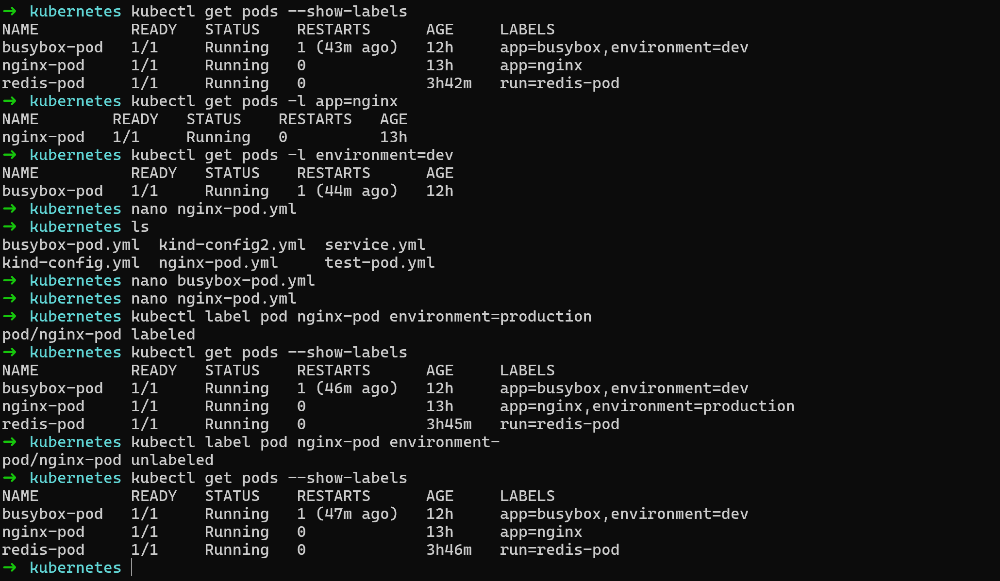

Write a manifest for a third pod with at least 3 labels (app, environment, team). Apply it and practice filtering.
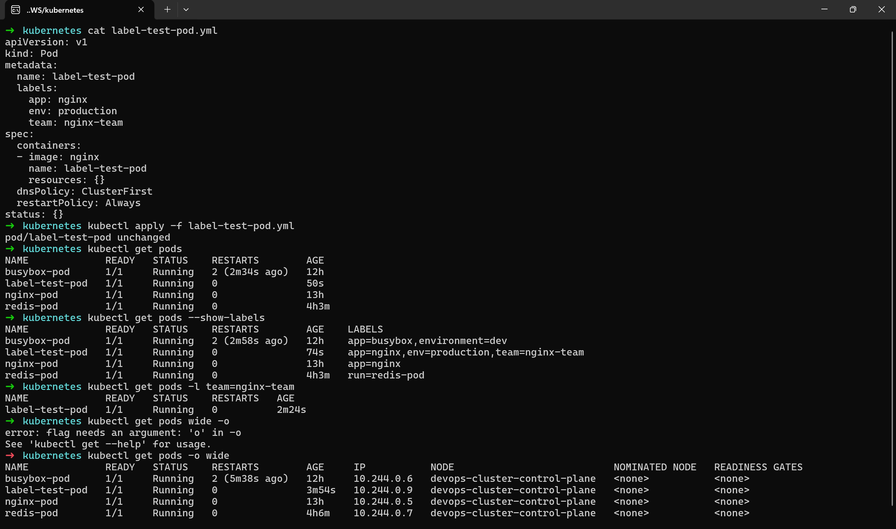

### Task 6: Clean Up
Delete all the pods you created:
# Delete by name
kubectl delete pod nginx-pod
kubectl delete pod busybox-pod
kubectl delete pod redis-pod
# Or delete using the manifest file
kubectl delete -f nginx-pod.yaml
# Verify everything is gone
kubectl get pods

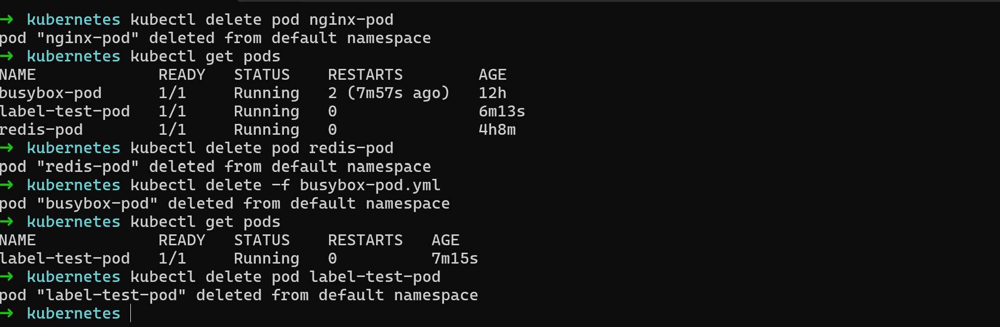
