### Task 1: Explore Default Namespaces
Kubernetes comes with built-in namespaces. List them:
- kubectl get namespaces

You should see at least:
- `default` — where your resources go if you do not specify a namespace
- `kube-system` — Kubernetes internal components (API server, scheduler, etc.)
- `kube-public` — publicly readable resources
- `kube-node-lease` — node heartbeat tracking

- kubectl get pods -n kube-system
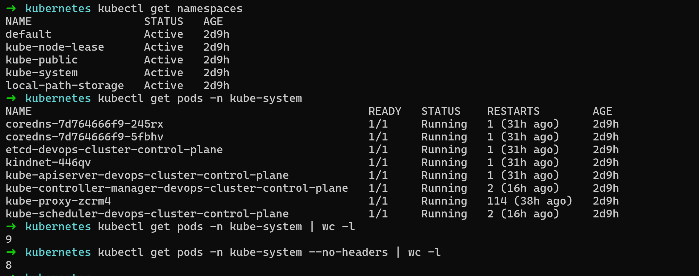

**Verify:** How many pods are running in `kube-system`?
There are 8 nodes in the kube-system namespace

### Task 2: Create and Use Custom Namespaces
**Create two namespaces — one for a development environment and one for staging:**
- kubectl create namespace dev
- kubectl create namespace staging
- kubectl get namespaces

**You can also create a namespace from a manifest:**
# namespace.yaml
apiVersion: v1
kind: Namespace
metadata:
  name: production

- kubectl apply -f namespace.yaml
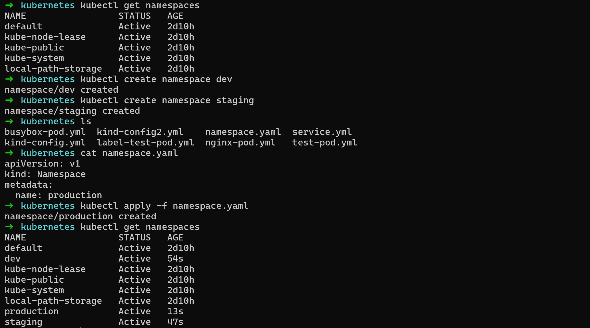

**Now run a pod in a specific namespace:**
- kubectl run nginx-dev --image=nginx:latest -n dev
- kubectl run nginx-staging --image=nginx:latest -n staging
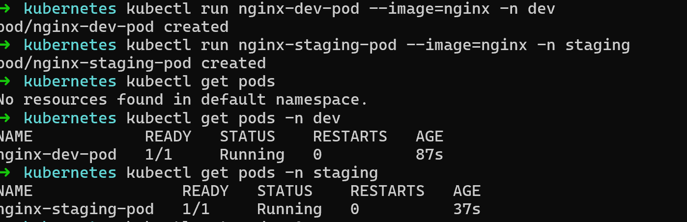

**Verify:** Does `kubectl get pods` show these pods? What about `kubectl get pods -A`?
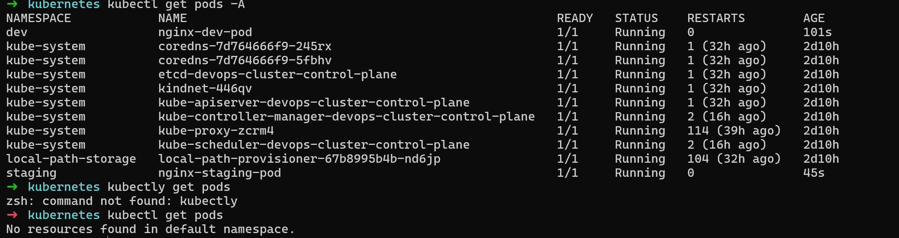

### Task 3: Create Your First Deployment
A Deployment tells Kubernetes: "I want X replicas of this Pod running at all times." If a Pod crashes, the Deployment controller recreates it automatically.
Create a file `nginx-deployment.yaml`:

Key differences from a standalone Pod:
- `kind: Deployment` instead of `kind: Pod`
- `apiVersion: apps/v1` instead of `v1`
- `replicas: 3` tells Kubernetes to maintain 3 identical pods
- `selector.matchLabels` connects the Deployment to its Pods
- `template` is the Pod template — the Deployment creates Pods using this blueprint

Apply it:
- kubectl apply -f nginx-deployment.yaml
- kubectl get deployments -n dev
- kubectl get pods -n dev

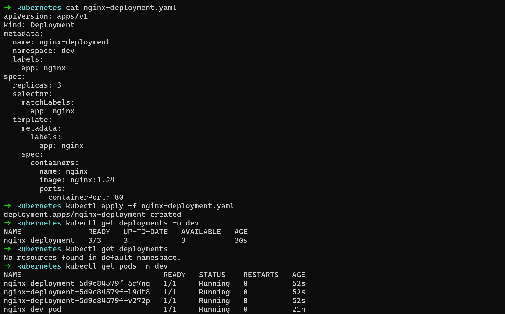

3 pods with names like `nginx-deployment-xxxxx-yyyyy` is seen.

**What do the READY, UP-TO-DATE, and AVAILABLE columns mean in the deployment output?**
- kubectl get deployments -n dev
NAME               READY   UP-TO-DATE   AVAILABLE   AGE
nginx-deployment   3/3     3            3           30s

# READY
Displays how many pods are running vs desired. In above example: 3 pods running over 3 desired

# UP-TO-DATE
Display the number of replicas/pods updated to achieve the desired state.

# AVAILABLE
Display how many replicas of the application are available to serve the traffic.

### Task 4: Self-Healing — Delete a Pod and Watch It Come Back
This is the key difference between a Deployment and a standalone Pod.

# List pods
- kubectl get pods -n dev

# Delete one of the deployment's pods (use an actual pod name from your output)
- kubectl delete pod <pod-name> -n dev

# Immediately check again
- kubectl get pods -n dev

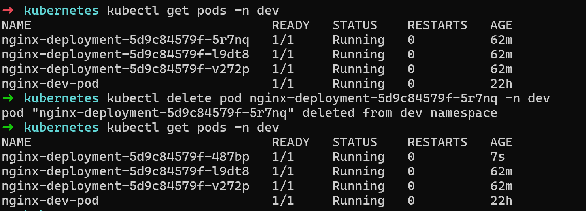

The Deployment controller detects that only 2 of 3 desired replicas exist and immediately creates a new one. The deleted pod is replaced within seconds.

**Is the replacement pod's name the same as the one you deleted, or different?**
The replacement pod has a different name as seen in the above example.

### Task 5: Scale the Deployment
Change the number of replicas:

# Scale up to 5
- kubectl scale deployment nginx-deployment --replicas=5 -n dev
- kubectl get pods -n dev
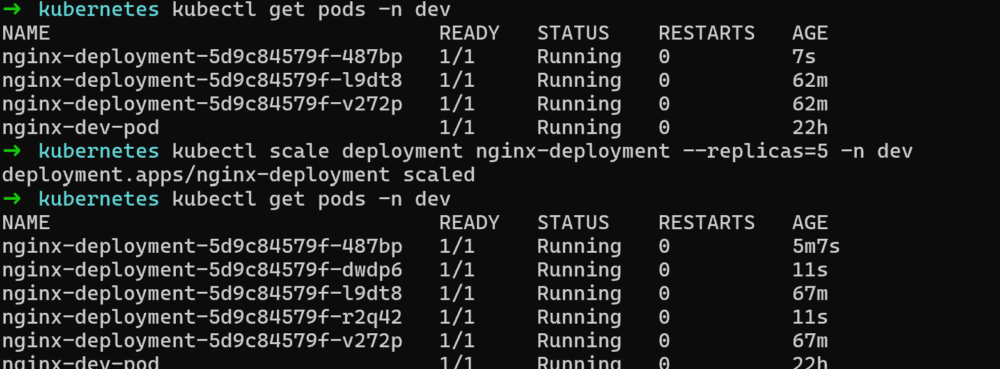

# Scale down to 2
- kubectl scale deployment nginx-deployment --replicas=2 -n dev
- kubectl get pods -n dev
Watch how Kubernetes creates or terminates pods to match the desired count.
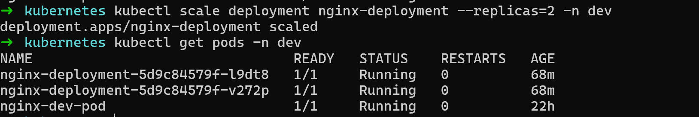

You can also scale by editing the manifest — change `replicas: 4` in your YAML file and run `kubectl apply -f nginx-deployment.yaml` again.
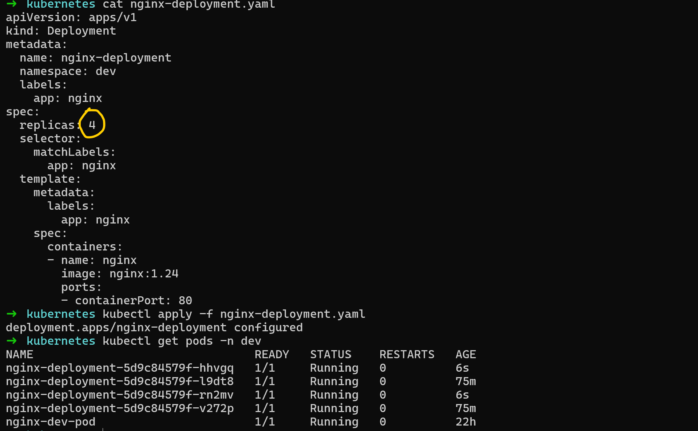

**When you scaled down from 5 to 2, what happened to the extra pods?**
When we scale down the extra pods are deleted.

### Task 6: Rolling Update
Update the Nginx image version to trigger a rolling update:
- kubectl set image deployment/nginx-deployment nginx=nginx:1.25 -n dev

**Watch the rollout in real time:**
- kubectl rollout status deployment/nginx-deployment -n dev

Kubernetes replaces pods one by one — old pods are terminated only after new ones are healthy. This means zero downtime.

Check the rollout history:
- kubectl rollout history deployment/nginx-deployment -n dev
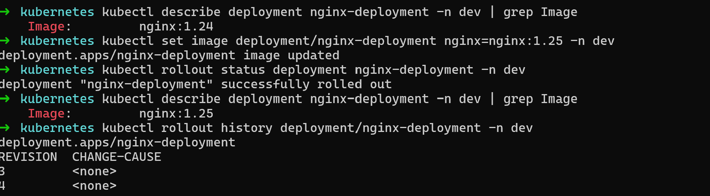

Now roll back to the previous version:
- kubectl rollout undo deployment/nginx-deployment -n dev
- kubectl rollout status deployment/nginx-deployment -n dev
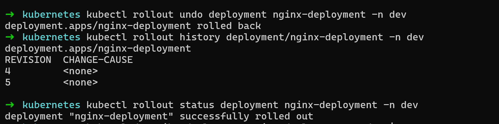

Verify the image is back to the previous version:
- kubectl describe deployment nginx-deployment -n dev | grep Image

**What image version is running after the rollback?**
THe nginx image was 1.24 initially. It was updated to 1.25 and then rollout undo to 1.24 which is shown in image above.
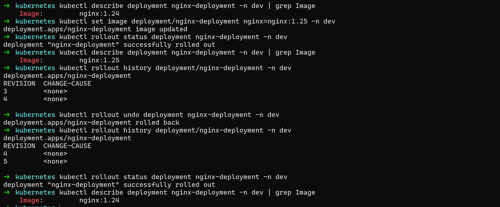

### Task 7: Clean Up

- kubectl delete deployment nginx-deployment -n dev
- kubectl delete pod nginx-dev -n dev
- kubectl delete pod nginx-staging -n staging
- kubectl delete namespace dev staging production

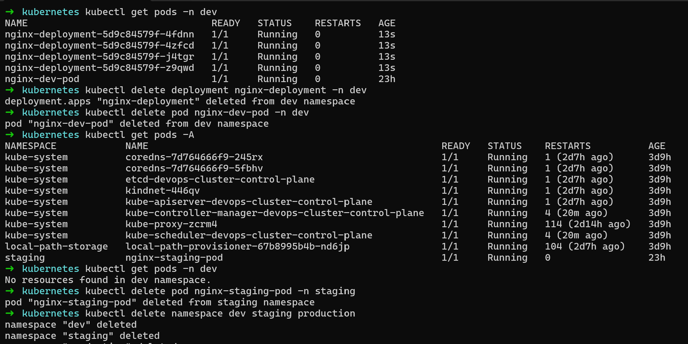

Deleting a namespace removes everything inside it. Be very careful with this in production.

- kubectl get namespaces
- kubectl get pods -A

