## Challenge Tasks

### Task 1: Create a ConfigMap from Literals
1. Use `kubectl create configmap` with `--from-literal` to create a ConfigMap called `app-config` with keys `APP_ENV=production`, `APP_DEBUG=false`, and `APP_PORT=8080`
2. Inspect it with `kubectl describe configmap app-config` and `kubectl get configmap app-config -o yaml`
3. Notice the data is stored as plain text — no encoding, no encryption

Can you see all three key-value pairs?
- Yes all three key-value pairs visible shown as below
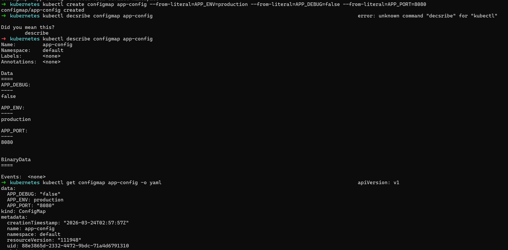

### Task 2: Create a ConfigMap from a File
1. Write a custom Nginx config file that adds a `/health` endpoint returning "healthy"
2. Create a ConfigMap from this file using `kubectl create configmap nginx-config --from-file=default.conf=<your-file>`
3. The key name (`default.conf`) becomes the filename when mounted into a Pod

Does `kubectl get configmap nginx-config -o yaml` show the file contents?
- File contents are shown using above command.
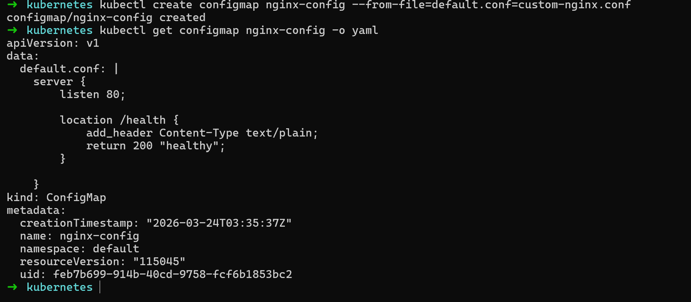

### Task 3: Use ConfigMaps in a Pod
1. Write a Pod manifest that uses `envFrom` with `configMapRef` to inject all keys from `app-config` as environment variables. Use a busybox container that prints the values.
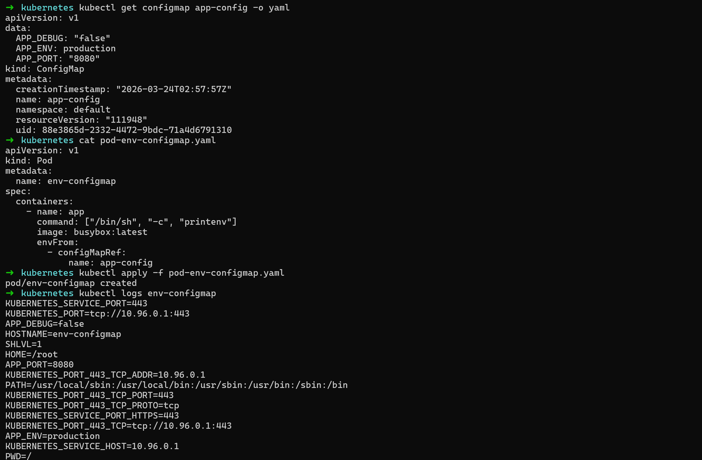

2. Write a second Pod manifest that mounts `nginx-config` as a volume at `/etc/nginx/conf.d`. Use the nginx image.
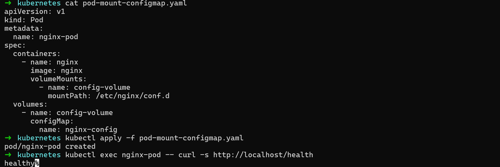

3. Test that the mounted config works: `kubectl exec <pod> -- curl -s http://localhost/health`
Use environment variables for simple key-value settings. Use volume mounts for full config files.

Does the `/health` endpoint respond?
The nginx pods are running n healthy
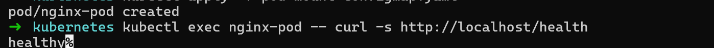

### Task 4: Create a Secret
1. Use `kubectl create secret generic db-credentials` with `--from-literal` to store `DB_USER=admin` and `DB_PASSWORD=s3cureP@ssw0rd`
2. Inspect with `kubectl get secret db-credentials -o yaml` — the values are base64-encoded
3. Decode a value: `echo '<base64-value>' | base64 --decode`

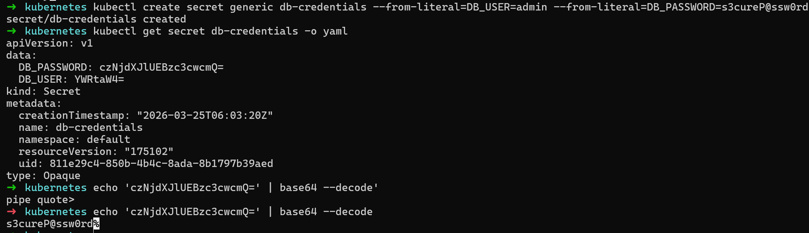

**base64 is encoding, not encryption.** Anyone with cluster access can decode Secrets. The real advantages are RBAC separation, tmpfs storage on nodes, and optional encryption at rest.
Can you decode the password back to plaintext?
- Yes the password can be decoded to plain which is shown in above screenshot

### Task 5: Use Secrets in a Pod
1. Write a Pod manifest that injects `DB_USER` as an environment variable using `secretKeyRef`
2. In the same Pod, mount the entire `db-credentials` Secret as a volume at `/etc/db-credentials` with `readOnly: true`
3. Verify: each Secret key becomes a file, and the content is the decoded plaintext value
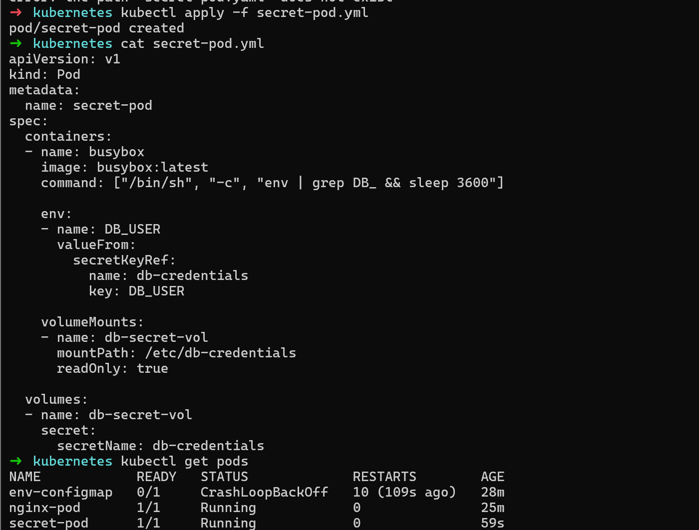

Are the mounted file values plaintext or base64?
- The mounted file values are plain text.
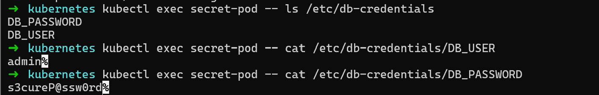

### Task 6: Update a ConfigMap and Observe Propagation
1. Create a ConfigMap `live-config` with a key `message=hello`
2. Write a Pod that mounts this ConfigMap as a volume and reads the file in a loop every 5 seconds
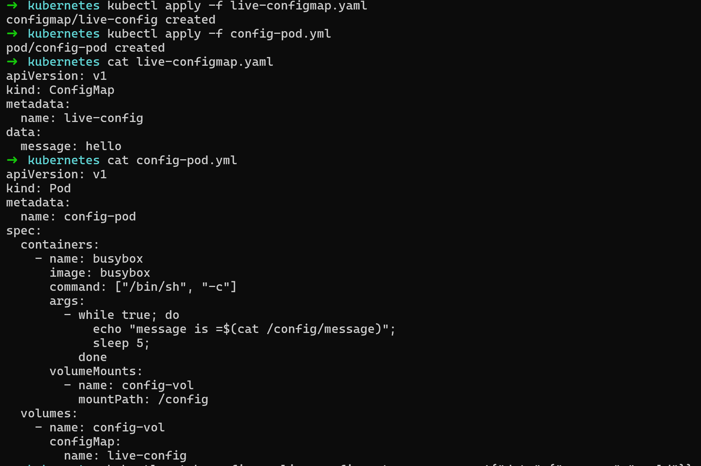

3. Update the ConfigMap: `kubectl patch configmap live-config --type merge -p '{"data":{"message":"world"}}'`
4. Wait 30-60 seconds — the volume-mounted value updates automatically
5. Environment variables from earlier tasks do NOT update — they are set at pod startup only
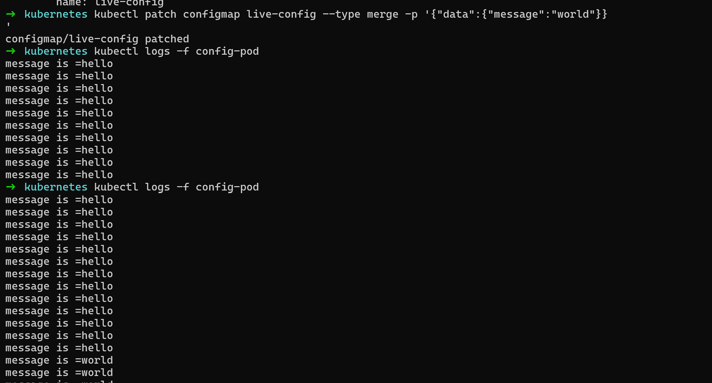

**Verify:** Did the volume-mounted value change without a pod restart?
From above image you see the value of volume mounted changes from hello to world gradually.

### Task 7: Clean Up
Delete all pods, ConfigMaps, and Secrets you created.
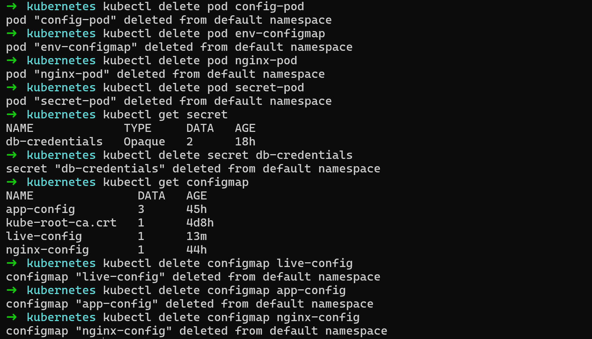