### Task 1: Understand Infrastructure as Code

**1. What is Infrastructure as Code (IaC)? Why does it matter in DevOps?**
- IaC means managing and provisioning infrastructure like servers, networks, databases  through code instead of creating console.

**It matters in DevOps because:**
- Infrastructure needs to be created several times. So we can just write a code file. Later teams can review, test and automate 
  infrastructure changes. This speeds up delivery — spin up environments in minutes not hours

 
**2. What problems does IaC solve compared to manually creating resources in the AWS console?**
AWS:
- Easy to make mistakes while clicking
- No history of what changed
- Hard to recreate exact setup
- Cant be scaled across teams
- The resources must be created or deleted individually

Iac:
- Code is consistent and repeatable
- Infrastructure can be created and deleted with no manual clicks but just by executing the code
- History of what is created and deleted available
- Same setup across the team

**3. How is Terraform different from AWS CloudFormation, Ansible, and Pulumi?**
- **CloudFormation** - AWS only, locked to Amazon. 
- **Terraform** - works across any cloud (AWS, GCP, Azure)

- **Ansible** - is a configuration management tool (installs software, configures servers). 
- **Terraform** - is for provisioning the infrastructure 

- **Pulumi** - similar to Terraform, but you write code in Python/JavaScript/Go. 
- **Terraform** - uses its own language (HCL)

**4. What does it mean that Terraform is "declarative" and "cloud-agnostic"?**
- Terraform is "declarative" means when I write the code in terraform for creating EC2 instance with this AMI and instance type 
and Terraform figures out how to create it. It doesn't need step-by-step instruction like ansible.
- Cloud-agnostic means the same Terraform tool and workflow works on AWS, GCP, Azure etc. 
You just swap the provider — the rest of the workflow stays the same. 

    
### Task 2: Install Terraform and Configure AWS
1. Install Terraform:

# Linux (amd64)
- wget -O - https://apt.releases.hashicorp.com/gpg | sudo gpg --dearmor -o /usr/share/keyrings/hashicorp-archive-keyring.gpg
- echo "deb [signed-by=/usr/share/keyrings/hashicorp-archive-keyring.gpg] https://apt.releases.hashicorp.com $(lsb_release -cs) main" | sudo tee /etc/apt/sources.list.d/hashicorp.list
- sudo apt update && sudo apt install terraform

2. Verify:
- terraform -version
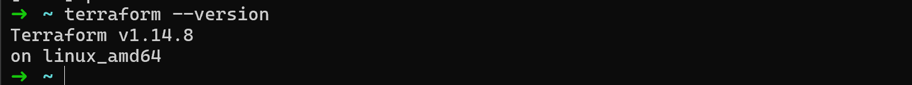

3. Install and configure the AWS CLI:
aws configure
Verify AWS access:
- aws sts get-caller-identity
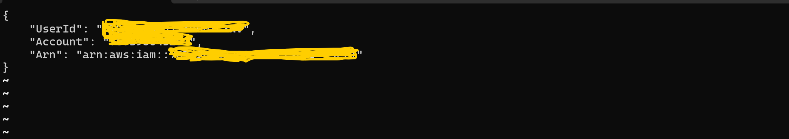

### Task 3: Your First Terraform Config -- Create an S3 Bucket
Create a project directory and write your first Terraform config:
- mkdir terraform-basics && cd terraform-basics

Create a file called main.tf with:
1. A terraform block with required_providers specifying the aws provider
2. A provider "aws" block with your region
3. A resource "aws_s3_bucket" that creates a bucket with a globally unique name
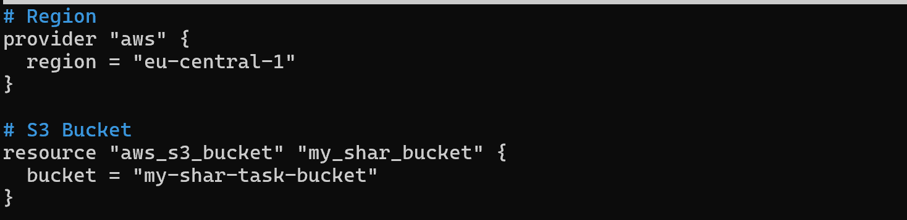

Run the Terraform lifecycle:
terraform init      # Download the AWS provider
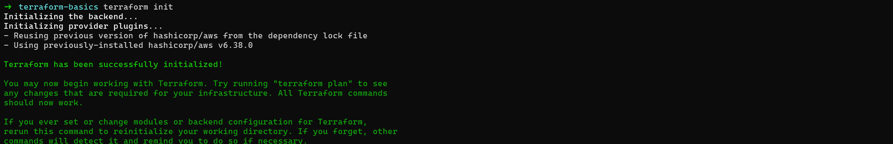
terraform plan      # Preview what will be created
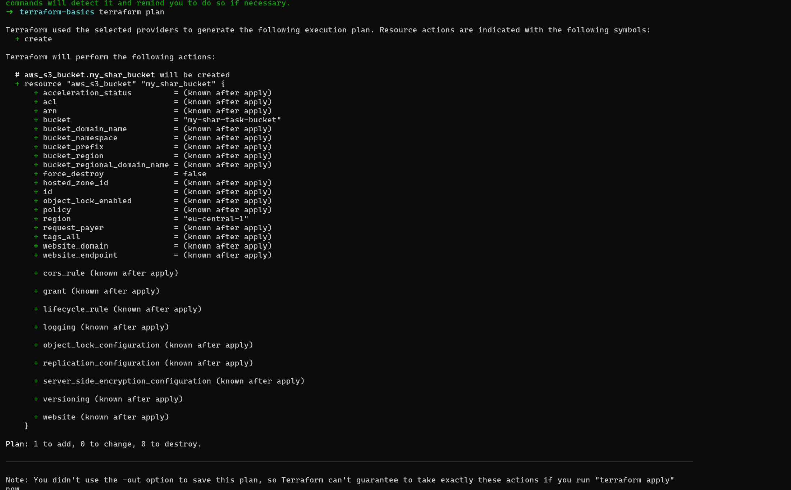
terraform apply     # Create the bucket (type 'yes' to confirm)
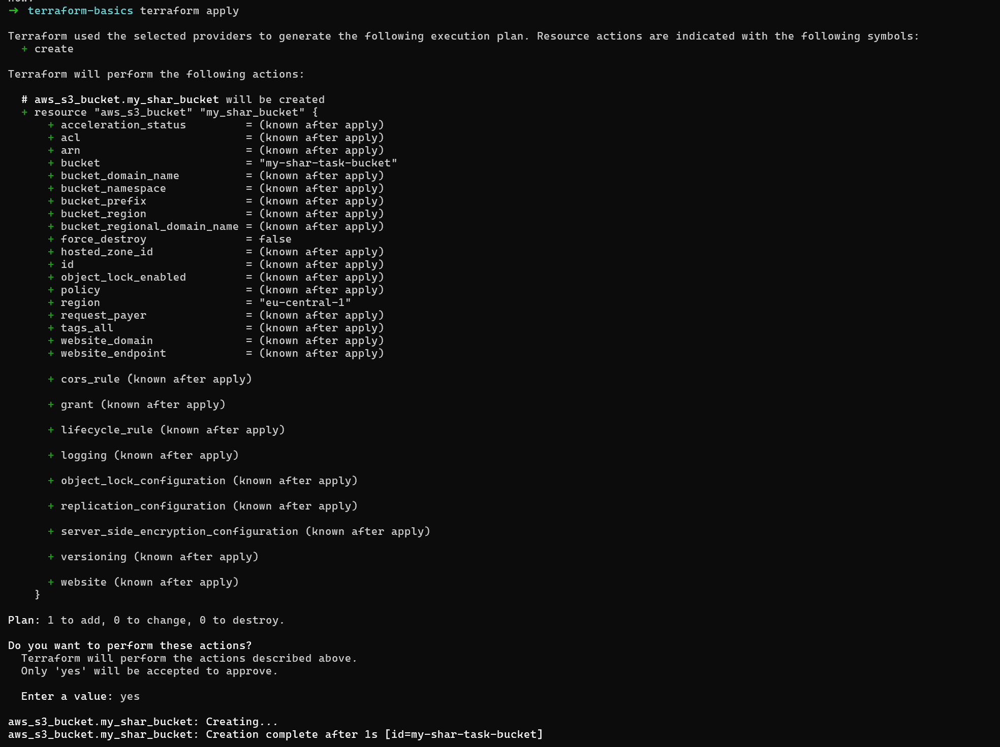
Go to the AWS S3 console and verify your bucket exists.
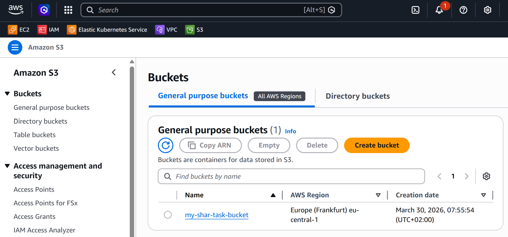

**What did terraform init download?**
- The 'terraform init' downloads the AWS provider plugin which is the code Terraform uses to talk to AWS APIs which shown in image above.

**What does the .terraform/ directory contain?**
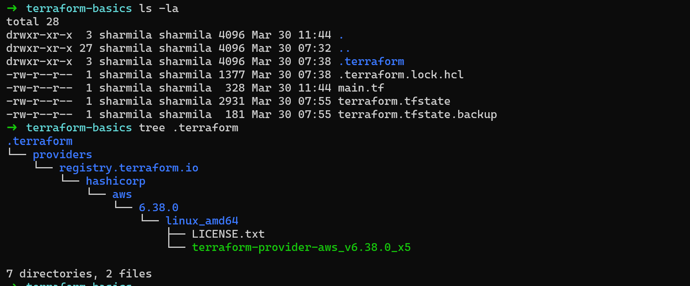
- The .terraform/ directory contains:
  .terraform/providers/ 
  .terraform.lock.hcl — a lock file that records the exact version of the provider downloaded. 

### Task 4: Add an EC2 Instance
In the same main.tf, add:
1. A resource "aws_instance" using AMI ami-0f5ee92e2d63afc18 (Amazon Linux 2 in ap-south-1 -- use the correct AMI for your region)
2. Set instance type to t2.micro
3. Add a tag: Name = "TerraWeek-Day1"
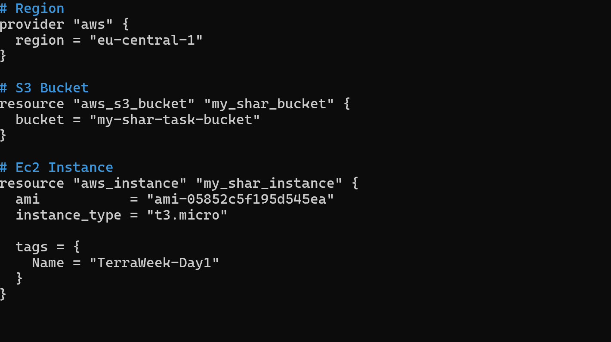

Run:
terraform plan      # You should see 1 resource to add (bucket already exists)
terraform apply
Go to the AWS EC2 console and verify your instance is running with the correct name tag.
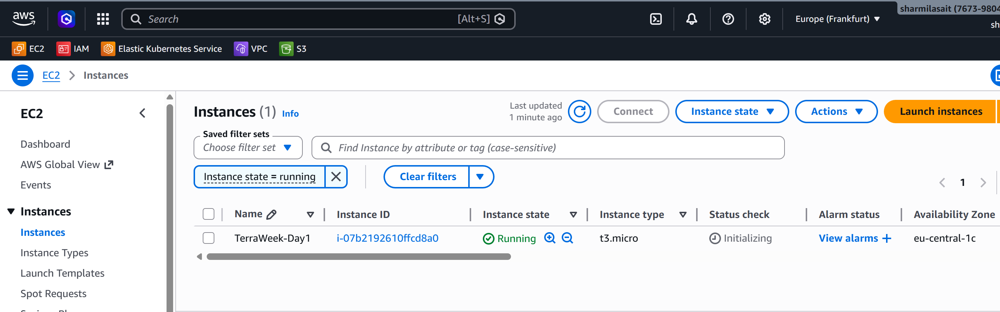

**How does Terraform know the S3 bucket already exists and only the EC2 instance needs to be created?**
Terraform knows because of the state file (terraform.tfstate). When I created the S3 bucket earlier, Terraform saved it in the state file.
So when I ran terraform plan again after adding the EC2 instance, Terraform compared:

What is in my code — S3 bucket + EC2 instance
What is in the state file — S3 bucket already exists

Since the S3 bucket was already in the state file and nothing changed about it, Terraform knew it didn't need to touch it. It only saw the EC2 instance as new — so it showed 1 resource to add.

### Task 5: Understand the State File
Terraform tracks everything it creates in a state file. Time to inspect it.

**1. Open terraform.tfstate in your editor -- read the JSON structure**
**2. Run these commands and document what each returns:**
- terraform show                          # Human-readable view of current state
- terraform state list                    # List all resources Terraform manages
- terraform state show aws_s3_bucket.<name>   # Detailed view of a specific resource
- terraform state show aws_instance.<name>

1. terraform show
- Displays the full current state in a human-readable format.
- It shows detailed information about all managed resources, including:
  EC2 instance (ID, state, IPs, tags, etc.), S3 bucket (name, ARN, region, configuration)

2. terraform state listn the Terraform state.
- Output shows:  
  aws_instance.example
  aws_s3_bucket.bucket
- This confirms Terraform is managing both resources.

3. terraform state show aws_s3_bucket.bucket
- Displays detailed state information for the S3 bucket only, such as:
  Bucket name and ARN
  Region
  Encryption settings
  Versioning configuration

4. terraform state show aws_instance.instance
- Displays detailed state information for the EC2 instance, including:
  Instance ID and state (running)
  Instance type
  Public & private IPs
  Subnet and security groups
  Tags (Name = TerraWeek-Day1)

**3. Answer these questions in your notes:**
- What information does the state file store about each resource?
  State file stores — resource type, ID, IP, tags, all attributes AWS assigned

- Why should you never manually edit the state file?
  Terraform uses it as source of truth, manual edits cause it to get confused and potentially destroy/recreate resources

- Why should the state file not be committed to Git?
  Don't commit to Git since it contains sensitive data like passwords and IPs, and causes merge conflicts in teams. Use S3 remote state instead.

### Task 6: Modify, Plan, and Destroy
**1. Change the EC2 instance tag from "TerraWeek-Day1" to "TerraWeek-Modified" in your main.tf**
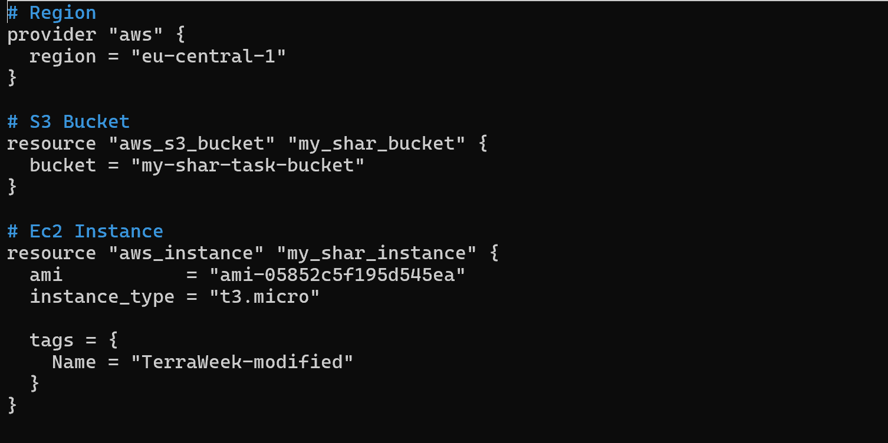

**2. Run terraform plan and read the output carefully:**
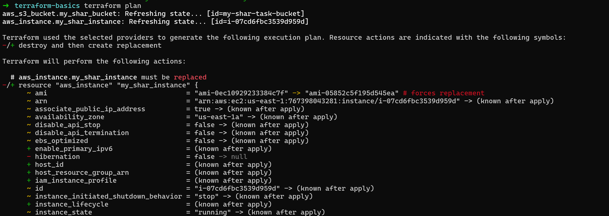
**What do the ~, +, and - symbols mean?**
~  modify in place — resource exists but something is changing (like a tag)
+  add — new resource being created
-  destroy — resource is being deleted

**Is this an in-place update or destroy-and-recreate?**
Changing a tag is an in-place update — shown with ~. Terraform doesn't need to destroy the EC2 instance, it just updates the tag directly on the existing instance. 
AWS allows tag changes without touching the instance itself.

**3. Apply the change**
**4. Verify the tag changed in the AWS console**
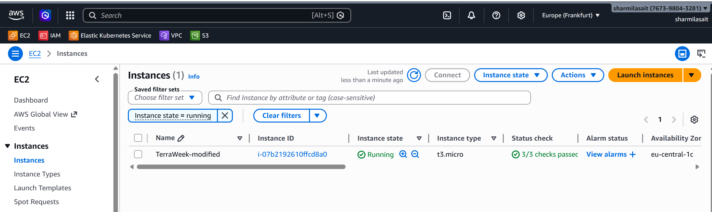

**5. Finally, destroy everything:**
- terraform destroy
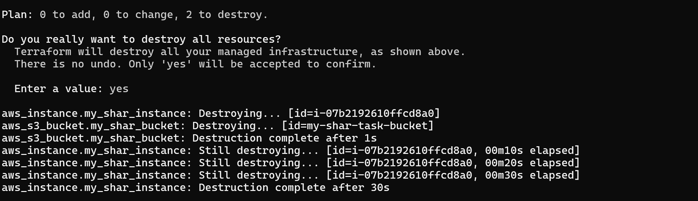

**6. Verify in the AWS console -- both the S3 bucket and EC2 instance should be gone**
All resources deleted in AWS :)