### Task 1: Explore the AWS Provider
1. Create a new project directory: `terraform-aws-infra`
2. Write a `providers.tf` file:
- Define the `terraform` block with `required_providers` pinning the AWS provider to version `~> 5.0`
- Define the `provider "aws"` block with your region
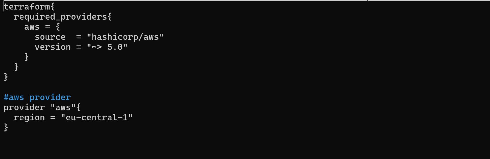

3. Run `terraform init` and check the output -- what version was installed?
- The init command installed V5.100.0
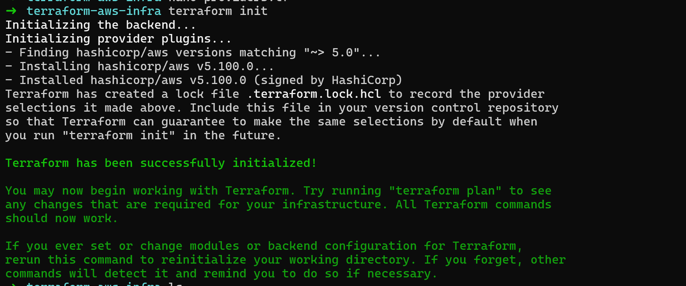

4. Read the provider lock file `.terraform.lock.hcl` -- what does it do?
- .terraform.lock.hcl locks the exact version of the provider that was downloaded when you ran terraform init.
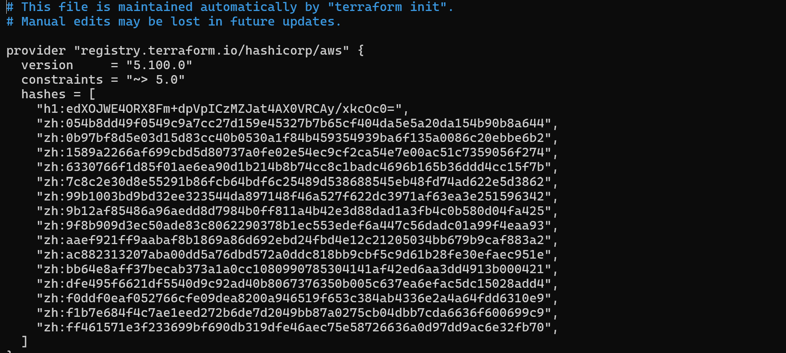
- version shows the exact version that was downloaded
- constraints shows the rule you set in terraform.tf e.g. ~> 5.0
- hashes shows a checksum to verify the downloaded provider is not corrupted or tampered with

**What does `~> 5.0` mean? How is it different from `>= 5.0` and `= 5.0.0`?**
- (~> 5.0) - Terraform will download AWS provider 5.x — so 5.1, 5.2 until 5.9 but it will never jump to 6.0.
Safe because minor updates usually just add new features or bug fixes, no breaking changes.

- (>= 5.0) - Terraform can download any version from 5.0 upwards — including 6.0, 7.0. 
Dangerous because if AWS provider releases version 6.0 with breaking changes, your terraform init might download it and break everything.

- = 5.0.0 - Terraform will only use exactly 5.0.0. Too strict — if Hashicorp releases 5.0.1 with a critical bug fix, you won't get it.

### Task 2: Build a VPC from Scratch
Create a `main.tf` and define these resources one by one:

1. `aws_vpc` -- CIDR block `10.0.0.0/16`, tag it `"TerraWeek-VPC"`
2. `aws_subnet` -- CIDR block `10.0.1.0/24`, reference the VPC ID from step 1, enable public IP on launch, tag it `"TerraWeek-Public-Subnet"`
3. `aws_internet_gateway` -- attach it to the VPC
4. `aws_route_table` -- create it in the VPC, add a route for `0.0.0.0/0` pointing to the internet gateway
5. `aws_route_table_association` -- associate the route table with the subnet

Run `terraform plan` -- you should see 5 resources to create.

**Verify:** Apply and check the AWS VPC console. Can you see all five resources connected?

### Task 2: Build a VPC from Scratch
Create a `main.tf` and define these resources one by one:

1. `aws_vpc` -- CIDR block `10.0.0.0/16`, tag it `"TerraWeek-VPC"`
2. `aws_subnet` -- CIDR block `10.0.1.0/24`, reference the VPC ID from step 1, enable public IP on launch, tag it `"TerraWeek-Public-Subnet"`
3. `aws_internet_gateway` -- attach it to the VPC
4. `aws_route_table` -- create it in the VPC, add a route for `0.0.0.0/0` pointing to the internet gateway
5. `aws_route_table_association` -- associate the route table with the subnet
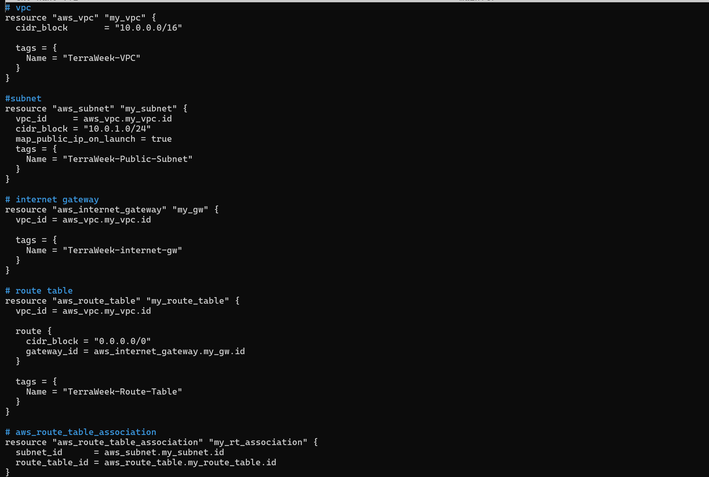

Run `terraform plan` -- you should see 5 resources to create.
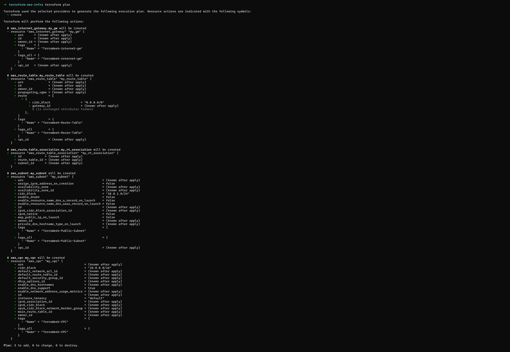

**Apply and check the AWS VPC console. Can you see all five resources connected?**
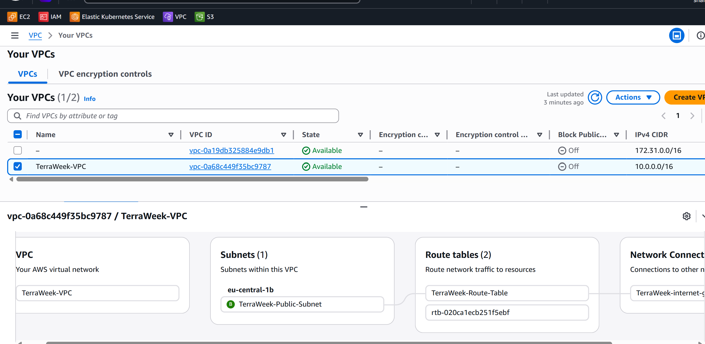

### Task 3: Understand Implicit Dependencies
Look at your `main.tf` carefully:

1. The subnet references `aws_vpc.main.id` -- this is an implicit dependency
2. The internet gateway references the VPC ID -- another implicit dependency
3. The route table association references both the route table and the subnet

Answer these questions:
- How does Terraform know to create the VPC before the subnet?
The subnet references aws_vpc.my_vpc.id — Terraform sees this and automatically understands that it needs the VPC to exist first to get its ID. 
It builds a dependency graph internally and figures out the correct order. 

- What would happen if you tried to create the subnet before the VPC existed?
It would fail because the subnet needs a vpc_id from AWS. Without the VPC existing first there is no ID to pass in. AWS would reject the request.

- Find all implicit dependencies in your config and list them
aws_subnet.my_subnet
└── depends on aws_vpc.my_vpc.id

aws_internet_gateway.my_gw
└── depends on aws_vpc.my_vpc.id

aws_route_table.my_route_table
└── depends on aws_vpc.my_vpc.id
└── depends on aws_internet_gateway.my_gw.id

aws_route_table_association.my_rt_association
└── depends on aws_subnet.my_subnet.id
└── depends on aws_route_table.my_route_table.id

So the creation order Terraform follows is:
**VPC → Subnet + IGW → Route Table → Route Table Association**

### Task 2: Build a VPC from Scratch
Create a `main.tf` and define these resources one by one:

1. `aws_vpc` -- CIDR block `10.0.0.0/16`, tag it `"TerraWeek-VPC"`
2. `aws_subnet` -- CIDR block `10.0.1.0/24`, reference the VPC ID from step 1, enable public IP on launch, tag it `"TerraWeek-Public-Subnet"`
3. `aws_internet_gateway` -- attach it to the VPC
4. `aws_route_table` -- create it in the VPC, add a route for `0.0.0.0/0` pointing to the internet gateway
5. `aws_route_table_association` -- associate the route table with the subnet

Run `terraform plan` -- you should see 5 resources to create.

**Verify:** Apply and check the AWS VPC console. Can you see all five resources connected?

---

### Task 3: Understand Implicit Dependencies
Look at your `main.tf` carefully:

1. The subnet references `aws_vpc.main.id` -- this is an implicit dependency
2. The internet gateway references the VPC ID -- another implicit dependency
3. The route table association references both the route table and the subnet

Answer these questions:
- How does Terraform know to create the VPC before the subnet?
- What would happen if you tried to create the subnet before the VPC existed?
- Find all implicit dependencies in your config and list them

---

### Task 4: Add a Security Group and EC2 Instance
Add to your config:

1. `aws_security_group` in the VPC:
    - Ingress rule: allow SSH (port 22) from `0.0.0.0/0`
    - Ingress rule: allow HTTP (port 80) from `0.0.0.0/0`
    - Egress rule: allow all outbound traffic
    - Tag: `"TerraWeek-SG"`

2. `aws_instance` in the subnet:
    - Use Amazon Linux 2 AMI for your region
    - Instance type: `t2.micro`
    - Associate the security group
    - Set `associate_public_ip_address = true`
    - Tag: `"TerraWeek-Server"`
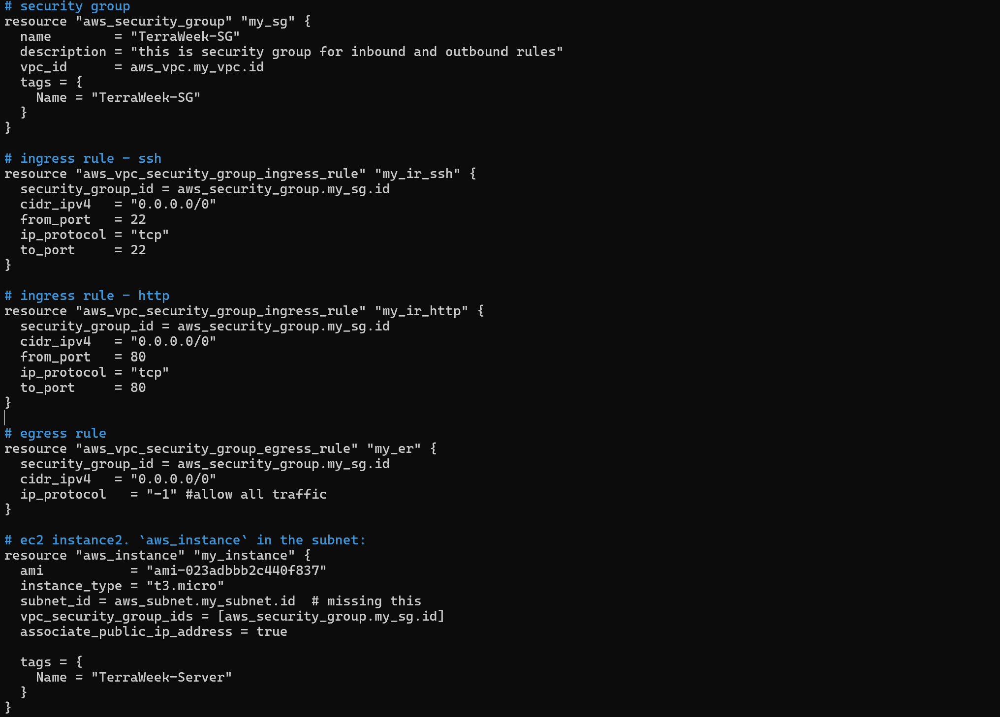
   
**Apply and verify -- your EC2 instance should have a public IP and be reachable.**
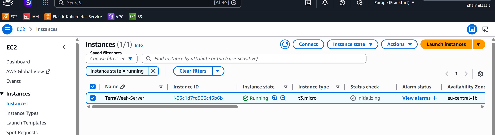

### Task 5: Explicit Dependencies with depends_on
Sometimes Terraform cannot detect a dependency automatically.

1. Add a second `aws_s3_bucket` resource for application logs
2. Add `depends_on = [aws_instance.main]` to the S3 bucket -- even though there is no direct reference, you want the bucket created only after the instance
3. Run `terraform plan` and observe the order

Now visualize the entire dependency tree:
- terraform graph | dot -Tpng > graph.png --> i dint hav eit installed
- use -> sudo apt install graphviz -y
  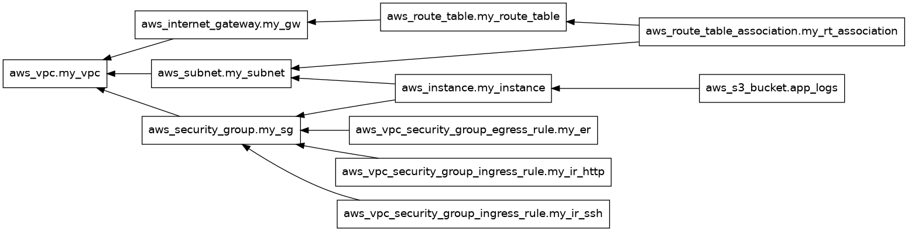

**When would you use `depends_on` in real projects? Give two examples.**
**Example 1 — IAM policy before EC2**
- If EC2 instance needs permission to access S3, the IAM policy must be attached first. But EC2 doesn't directly reference the IAM policy so Terraform won't know to wait. 
  So use depends_on to force the correct order.

**Example 2 — Database before App Server**
- If app server tries to connect to a database on startup, the database must be ready first. If there is no direct reference between the two resources we must use 
  depends_on to make sure the database is created before the app server.

### Task 6: Lifecycle Rules and Destroy
1. Add a `lifecycle` block to your EC2 instance:
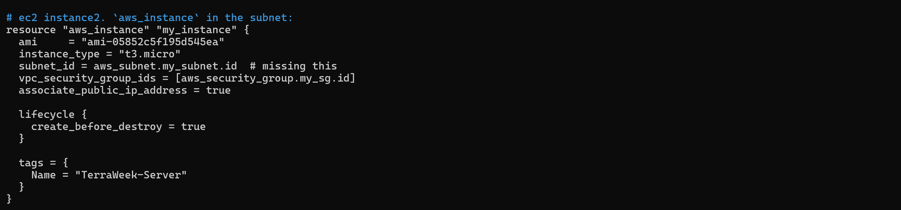

2. Change the AMI ID to a different one and run `terraform plan` -- observe that Terraform plans to create the new instance before destroying the old one
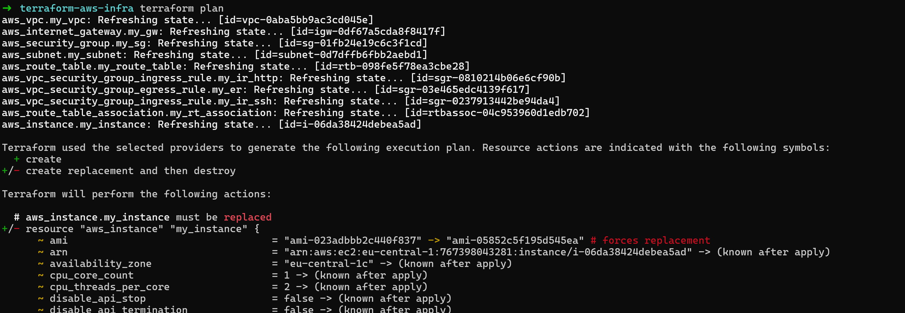

3. Destroy everything:
terraform destroy

4. Watch the destroy order -- Terraform destroys in reverse dependency order. Verify in the AWS console that everything is cleaned up.
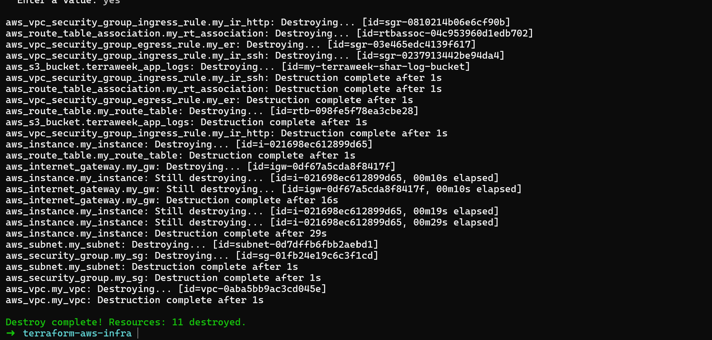

**What are the three lifecycle arguments (`create_before_destroy`, `prevent_destroy`, `ignore_changes`) and when would you use each?**
**create_before_destroy**
- By default Terraform destroys the old resource then creates the new one. With this set to true it creates the new one first then destroys the old one. Use it when you can't afford downtime 
  lifecycle {
    create_before_destroy = true
  }

**prevent_destroy**
- Prevents Terraform from destroying the resource. If you run terraform destroy or make a change that requires recreation it will throw an error and stop. 
  Use it on critical resources like production databases or S3 buckets you never want accidentally deleted.
  lifecycle {
    prevent_destroy = true
  }

**ignore_changes**
- Tells Terraform to ignore changes to specific attributes. If someone manually changes something in AWS console Terraform won't try to revert it.
  lifecycle {
    ignore_changes = [tags, instance_type]
  }